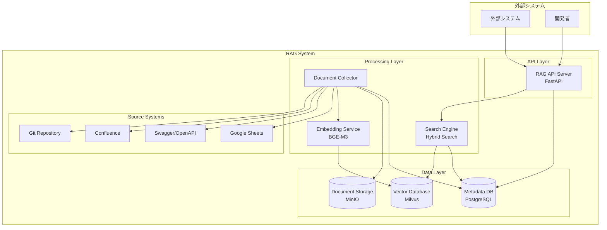

# システムアーキテクチャ設計書

## 概要

システム開発における仕様書や用語情報をまとめたRAGシステムの詳細設計書です。
BGE-M3を採用したハイブリッド検索によるRAGシステムを構築し、外部システムからの参照を可能にします。

## システム全体構成



## 主要コンポーネント

### 1. RAG API Server

- **役割**: 外部システムからのクエリを受け付け、検索結果を返す
- **技術スタック**: FastAPI + Python 3.11+
- **主要機能**:
  - 検索クエリの受付とレスポンス生成
  - 認証・認可
  - レート制限
  - ログ出力

### 2. Document Collector

- **役割**: 各種ソースシステムからドキュメントを収集・前処理
- **実行方式**:
  - バッチ処理（毎朝定期実行）
  - リアルタイム処理（Webhook経由）
- **主要機能**:
  - 差分検出とETL処理
  - ドキュメント正規化
  - メタデータ抽出

### 3. Embedding Service

- **役割**: BGE-M3を使用したドキュメントの埋め込み処理
- **モデル**: BAAI/BGE-M3
- **出力形式**:
  - Dense Vector (1024次元)
  - Sparse Vector (語彙重み)
  - Multi-Vector (長文局所特徴)

### 4. Search Engine

- **役割**: ハイブリッド検索による高精度な情報検索
- **検索方式**:
  - Dense Vector Search (意味検索)
  - Sparse Vector Search (キーワード検索)
  - Reciprocal Rank Fusion (RRF)

### 5. Vector Database

- **技術**: Milvus 2.3+
- **インデックス**: HNSW + IVF_FLAT
- **パーティション**: ドキュメントタイプ別

## 非機能要件

### 性能要件

- **検索レスポンス時間**: 95%ile < 500ms
- **同時接続数**: 100接続
- **埋め込み処理速度**: 1,000 doc/s (GPU環境)
- **可用性**: 99.9% (月間ダウンタイム < 44分)

### スケーラビリティ

- **ドキュメント数**: 最大100万件
- **ベクトル次元**: 1024次元
- **日次更新量**: 10,000件

### セキュリティ

- **API認証**: JWT Token + API Key
- **ネットワーク**: Private VPC
- **データ暗号化**: 保存時・転送時暗号化

## デプロイメント構成

### 開発環境

- **インフラ**: Docker Compose
- **リソース**: CPU 8core, Memory 32GB, GPU 16GB

### 本番環境

- **インフラ**: Kubernetes (GKE/EKS)
- **API Server**: 2 replicas (CPU 2core, Memory 8GB)
- **Embedding Service**: 1 replica (GPU 24GB)
- **Vector DB**: 3 node cluster (SSD 1TB each)

## データフロー

### 1. ドキュメント登録フロー

```mermaid
Source System → Document Collector → Document Processing →
Embedding Generation → Vector Storage → Metadata Update
```

### 2. 検索フロー

```mermaid
User Query → Query Processing → Embedding Generation →
Vector Search → Result Ranking → Response Generation
```

### 3. 更新フロー

```mermaid
Change Detection → Delta Processing → Re-embedding →
Vector Update → Index Refresh
```

## 監視・運用

### メトリクス

- API レスポンス時間・成功率
- 埋め込み処理時間・スループット
- Vector DB 使用率・検索精度
- システムリソース使用率

### アラート

- API エラー率 > 5%
- 検索レスポンス時間 > 1s
- GPU メモリ使用率 > 90%
- Vector DB ディスク使用率 > 80%

### ログ

- 構造化ログ (JSON形式)
- 検索クエリ・結果のトレーサビリティ
- エラーログと詳細スタックトレース
