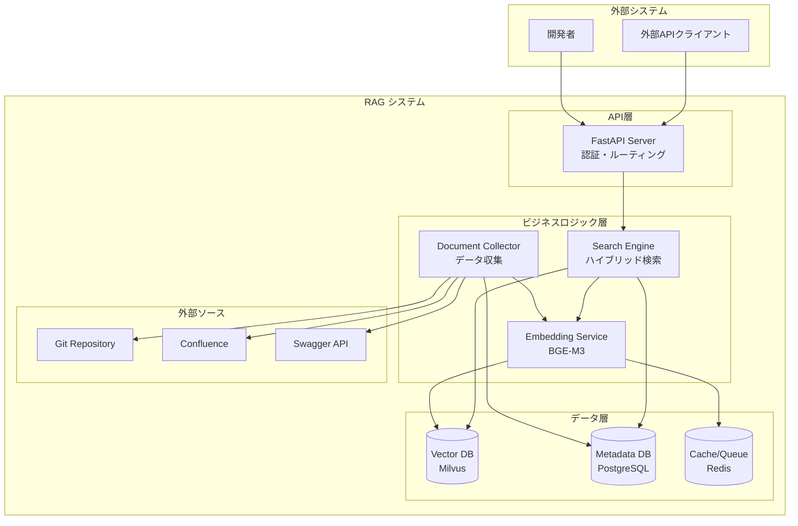

# Step00: システム全体概要

## 🎯 この章の目標

RAGシステム全体の構造を俯瞰し、各コンポーネントの基本的な役割と関係性を理解する

---

## 📋 システム概要

このシステムは **RAG (Retrieval-Augmented Generation) システム** で、システム開発における仕様書や用語情報を効率的に検索・参照できるプラットフォームです。

### 🎯 システムの目的

- 複数のソースシステム（Git、Confluence、Swagger等）から情報を収集
- BGE-M3モデルを使用した高精度なハイブリッド検索の提供
- 外部システムからのAPI呼び出しによる検索機能の統合

### 💻 技術スタック

- **API Framework**: FastAPI (Python 3.11+)
- **Vector Database**: Milvus 2.3+
- **Metadata Database**: PostgreSQL
- **Embedding Model**: BGE-M3 (BAAI/BGE-M3)
- **Task Queue**: Celery + Redis
- **Containerization**: Docker + Docker Compose
- **Orchestration**: Kubernetes (本番環境)

---

## 📂 ディレクトリ構成

```plaintext
spec_rag/
├── app/                     # アプリケーションのメインソースコード
│   ├── api/                # FastAPI エンドポイント定義
│   ├── core/               # 認証・例外処理等のコア機能
│   ├── database/           # データベース設定・マイグレーション
│   ├── models/             # データモデル（SQLAlchemy・Milvus）
│   ├── repositories/       # データアクセス層
│   ├── services/           # ビジネスロジック層
│   └── main.py            # FastAPIアプリケーションエントリーポイント
│
├── docs/                   # プロジェクト文書
│   ├── develop/           # 開発用設計文書
│   ├── learning/          # 学習用ドキュメント（このファイル）
│   └── spec/              # 仕様書
│
├── tests/                  # テストコード
├── docker-compose.yml     # 開発環境のコンテナ構成
├── pyproject.toml         # Python依存関係・設定
└── requirements.txt       # Python依存パッケージ
```

### 📁 主要ディレクトリの役割

| ディレクトリ | 責務 | 主要ファイル |
|-------------|------|-------------|
| `app/api/` | HTTP エンドポイント | `search.py`, `documents.py`, `auth.py` |
| `app/services/` | ビジネスロジック | `embedding_service.py`, `hybrid_search_engine.py` |
| `app/repositories/` | データアクセス | `document_repository.py`, `chunk_repository.py` |
| `app/models/` | データモデル | `database.py`, `milvus.py` |
| `app/core/` | 基盤機能 | `auth.py`, `exceptions.py` |

---

## 🏗️ システムアーキテクチャ図



---

## 🔄 主要な処理フロー

### 1. ドキュメント登録フロー

```plaintext
外部ソース → Document Collector → 前処理 → Embedding生成 → Vector保存 → メタデータ更新
```

### 2. 検索フロー

```plaintext
検索クエリ → 認証 → Embedding生成 → ハイブリッド検索 → 結果統合 → レスポンス返却
```

### 3. 管理フロー

```plaintext
管理者 → システム状態チェック → メトリクス取得 → 再インデックス実行
```

---

## 🔧 主要コンポーネント詳細

### API層 (`app/api/`)

- **search.py**: ハイブリッド検索、セマンティック検索、キーワード検索
- **documents.py**: ドキュメント管理（CRUD操作）
- **system.py**: システム監視、メトリクス、再インデックス
- **auth.py**: 認証・認可（JWT + API Key）

### ビジネスロジック層 (`app/services/`)

- **hybrid_search_engine.py**: RRF（Reciprocal Rank Fusion）による検索統合
- **embedding_service.py**: BGE-M3による多様なベクター生成
- **document_collector.py**: 外部ソースからのデータ収集
- **document_processing_service.py**: ドキュメント処理パイプライン

### データアクセス層 (`app/repositories/`)

- **document_repository.py**: PostgreSQLのドキュメントメタデータアクセス
- **chunk_repository.py**: ドキュメントチャンクの管理

---

## ⚙️ 設定・環境

### 重要な環境変数

- `DATABASE_URL`: PostgreSQL接続文字列
- `REDIS_URL`: Redis接続文字列
- `ENVIRONMENT`: 実行環境（development/staging/production）
- `TESTING`: テスト環境フラグ

### 開発環境の起動

```bash
# 依存サービス起動
docker-compose up -d

# アプリケーション起動
uvicorn app.main:app --reload

# API文書確認
# http://localhost:8000/docs
```

---

## ❗ 重要な注意点

### セキュリティ

- 本番環境では認証必須（JWT + API Key）
- テスト環境では `TESTING=true` で認証スキップ可能
- 管理者権限が必要な操作は厳密に制御

### パフォーマンス

- ベクター検索の目標レスポンス時間: <500ms (95%ile)
- GPU使用時の埋め込み生成: 推奨
- バッチ処理の優先使用

### データ整合性

- ドキュメント更新時のベクターと メタデータの同期
- 障害時のトランザクション整合性の確保

---

## 🎯 理解確認のための設問

### 基本理解

1. このRAGシステムの主要な技術スタックを3つ挙げてください
2. BGE-M3が生成する3種類のベクターの特徴を説明してください
3. ハイブリッド検索における「RRF」の役割は何ですか？

### アーキテクチャ理解

1. 外部システムから検索リクエストが来た場合の処理フローを追跡してください
2. 新しいドキュメントが追加される際に更新される必要があるデータ層を特定してください
3. システム監視で取得すべき重要メトリクスを5つ挙げてください

### 運用理解

1. システムのボトルネックになりやすい部分を2つ特定し、その理由を説明してください
2. 障害が発生した場合の調査ポイントを、アーキテクチャ層ごとに整理してください

---

## 📚 次のステップ

このシステム概要を理解したら、次の学習段階に進んでください：

- **Step01**: データフローの詳細
- **Step02**: API層の設計と実装
- **Step03**: ベクター検索エンジンの仕組み
- **Step04**: 埋め込みサービスとBGE-M3
- **Step05**: 認証・認可システム

各ステップで段階的に深く理解していくことで、システム全体を効率的に習得できます。
