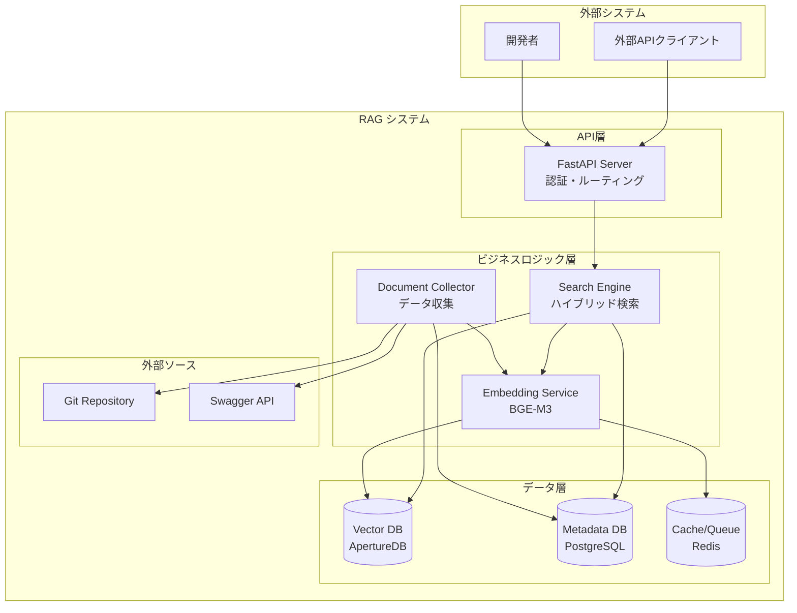

# Step00: システム全体概要

## 🎯 この章の目標

RAGシステム全体の構造を俯瞰し、各コンポーネントの基本的な役割と関係性を理解する

---

## 📋 システム概要

このシステムは **RAG (Retrieval-Augmented Generation) システム** で、システム開発における仕様書や用語情報を効率的に検索・参照できるプラットフォームです。

### 🎯 システムの目的

- 複数のソースシステム（Git、Swagger等）から情報を収集
- BGE-M3モデルを使用した高精度なハイブリッド検索の提供
- 外部システムからのAPI呼び出しによる検索機能の統合

### 💻 技術スタック

- **API Framework**: FastAPI (Python 3.11+)
- **Vector Database**: ApertureDB 0.5+
- **Metadata Database**: PostgreSQL
- **Embedding Model**: BGE-M3 (BAAI/BGE-M3)
- **Task Queue**: Celery + Redis
- **Containerization**: Docker + Docker Compose
- **Orchestration**: Kubernetes (本番環境)

---

## 📂 ディレクトリ構成

```plaintext
spec_rag/
├── app/                     # アプリケーションのメインソースコード
│   ├── api/                # FastAPI エンドポイント定義
│   ├── core/               # 認証・例外処理等のコア機能
│   ├── database/           # データベース設定・マイグレーション
│   ├── models/             # データモデル（SQLAlchemy・ApertureDB）
│   ├── repositories/       # データアクセス層
│   ├── services/           # ビジネスロジック層
│   └── main.py            # FastAPIアプリケーションエントリーポイント
│
├── docs/                   # プロジェクト文書
│   ├── develop/           # 開発用設計文書
│   ├── learning/          # 学習用ドキュメント（このファイル）
│   └── spec/              # 仕様書
│
├── tests/                  # テストコード
├── docker-compose.yml     # 開発環境のコンテナ構成
├── pyproject.toml         # Python依存関係・設定
└── requirements.txt       # Python依存パッケージ
```

### 📁 主要ディレクトリの役割

| ディレクトリ | 責務 | 主要ファイル |
|-------------|------|-------------|
| `app/api/` | HTTP エンドポイント | `search.py`, `documents.py`, `auth.py` |
| `app/services/` | ビジネスロジック | `embedding_service.py`, `hybrid_search_engine.py` |
| `app/repositories/` | データアクセス | `document_repository.py`, `chunk_repository.py` |
| `app/models/` | データモデル | `database.py`, `aperturedb.py` |
| `app/core/` | 基盤機能 | `auth.py`, `exceptions.py` |

---

## 🏗️ システムアーキテクチャ図



---

## 🔄 主要な処理フロー

### 1. ドキュメント登録フロー

```plaintext
外部ソース → Document Collector → 前処理 → Embedding生成 → Vector保存 → メタデータ更新
```

### 2. 検索フロー

```plaintext
検索クエリ → 認証 → Embedding生成 → ハイブリッド検索 → 結果統合 → レスポンス返却
```

### 3. 管理フロー

```plaintext
管理者 → システム状態チェック → メトリクス取得 → 再インデックス実行
```

---

## 🔧 主要コンポーネント詳細

### API層 (`app/api/`)

**実装ファイル**: `../../app/api/` ディレクトリ内

主要なAPIエンドポイントモジュール：

1. **search.py**: 検索関連エンドポイント
   - ハイブリッド検索（Dense + Sparse Vector）
   - セマンティック検索（意味的類似性）
   - キーワード検索（語彙マッチング）
   - 検索候補・設定の取得

2. **documents.py**: ドキュメント管理エンドポイント
   - CRUD操作（作成・読取・更新・削除）
   - バッチ処理・同期処理
   - 処理状況の監視

3. **system.py**: システム管理エンドポイント
   - システム状態の監視
   - メトリクスの取得
   - 再インデックス処理
   - 管理者向け操作

4. **auth.py**: 認証・認可エンドポイント
   - JWT Token認証
   - API Key認証
   - ユーザー管理
   - ロール管理

### ビジネスロジック層 (`app/services/`)

**実装ファイル**: `../../app/services/` ディレクトリ内

中核となるサービスクラス：

1. **hybrid_search_engine.py**: ハイブリッド検索エンジン
   - RRF（Reciprocal Rank Fusion）アルゴリズム実装
   - Dense/Sparse Vector検索の統合
   - フィルタリング・ファセット機能
   - 検索パフォーマンス最適化

2. **embedding_service.py**: BGE-M3埋め込みサービス
   - 3種類のベクター生成（Dense/Sparse/Multi-Vector）
   - バッチ処理最適化
   - GPU/CPU自動選択
   - キャッシング機能

3. **document_collector.py**: ドキュメント収集サービス
   - Git/Swagger等からのデータ取得
   - 前処理・正規化
   - 差分更新処理
   - エラーハンドリング

4. **document_processing_service.py**: ドキュメント処理パイプライン
   - チャンク分割
   - メタデータ抽出
   - ベクター生成の管理
   - 非同期処理の制御

### データアクセス層 (`app/repositories/`)

**実装ファイル**: `../../app/repositories/` ディレクトリ内

データ永続化を担当するリポジトリクラス：

1. **document_repository.py**: ドキュメントリポジトリ
   - PostgreSQLでのメタデータ管理
   - トランザクション制御
   - クエリ最適化
   - バルク操作

2. **chunk_repository.py**: チャンクリポジトリ
   - ドキュメントチャンクの管理
   - ベクターIDマッピング
   - 階層構造の保持
   - 検索統計の記録

---

## ⚙️ 設定・環境

### 重要な環境変数

**設定ファイル**: `../../app/core/config.py`

必須の環境変数：

1. **データベース接続**:
   - `DATABASE_URL`: PostgreSQL接続文字列
   - `REDIS_URL`: Redis接続文字列
   - `APERTUREDB_HOST`: ApertureDBホスト名
   - `APERTUREDB_PORT`: ApertureDBポート番号

2. **実行環境**:
   - `ENVIRONMENT`: 実行環境（development/staging/production）
   - `TESTING`: テスト環境フラグ（"true"でテストモード）
   - `DEBUG`: デバッグモード（本番環境ではfalse推奨）

3. **セキュリティ**:
   - `JWT_SECRET_KEY`: JWT署名用秘密鍵（32文字以上）
   - `API_KEY_PREFIX`: APIキーのプレフィックス
   - `CORS_ORIGINS`: 許可するオリジン（カンマ区切り）

4. **パフォーマンス**:
   - `EMBEDDING_BATCH_SIZE`: 埋め込み生成のバッチサイズ
   - `SEARCH_TIMEOUT`: 検索タイムアウト（秒）
   - `MAX_CONCURRENT_REQUESTS`: 最大同時リクエスト数

### 開発環境の起動

**開発環境構築手順**:

```bash
# 1. 仮想環境の作成と有効化
python -m venv venv
source venv/bin/activate  # Linux/Mac
# venv\Scripts\activate  # Windows

# 2. 依存パッケージのインストール
pip install -e ".[dev]"

# 3. 依存サービスの起動（Docker Compose使用）
docker-compose up -d

# 4. データベースマイグレーション
alembic upgrade head

# 5. アプリケーションの起動
uvicorn app.main:app --reload --host 0.0.0.0 --port 8000

# 6. API文書の確認
# ブラウザで http://localhost:8000/docs を開く
```

**Docker Composeサービス**:

- PostgreSQL（ポート5432）
- Redis（ポート6379）
- ApertureDB（ポート55555）
- Minio（ApertureDBストレージ、ポート9000）

---

## ❗ 重要な注意点

### セキュリティ

**実装ファイル**: `../../app/core/security.py`

1. **認証方式**:
   - 本番環境では認証必須（JWT + API Key）
   - テスト環境では `TESTING="true"` で認証スキップ可能
   - 管理者権限が必要な操作は厳密に制御
   - APIキーは環境ごとに異なる設定

2. **アクセス制御**:
   - RBAC（Role-Based Access Control）の実装
   - エンドポイント単位での権限チェック
   - リソースオーナーシップの検証
   - 監査ログの記録

### パフォーマンス

**監視ファイル**: `../../app/services/metrics_collector.py`

1. **パフォーマンス目標**:
   - ベクター検索の目標レスポンス時間: <500ms (95%ile)
   - API全体のレスポンス時間: <1秒 (95%ile)
   - 同時リクエスト処理数: 100リクエスト/秒

2. **最適化ポイント**:
   - GPU使用時の埋め込み生成（10-50倍高速化）
   - バッチ処理の優先使用（スループット向上）
   - 結果キャッシング（Redis使用）
   - 非同期処理の活用

### データ整合性

**実装ファイル**: `../../app/services/data_consistency_checker.py`

1. **同期メカニズム**:
   - ドキュメント更新時のベクターとメタデータの同期
   - Sagaパターンによる分散トランザクション
   - 障害時のロールバック処理
   - 定期的な整合性チェック

2. **データ保護**:
   - PostgreSQLのトランザクション活用
   - ApertureDBの整合性レベル設定
   - バックアップとリカバリ手順
   - データ検証の自動化

---

## 🎯 理解確認のための設問

### 基本理解

1. このRAGシステムの主要な技術スタックを3つ挙げてください
2. BGE-M3が生成する3種類のベクターの特徴を説明してください
3. ハイブリッド検索における「RRF」の役割は何ですか？

### アーキテクチャ理解

1. 外部システムから検索リクエストが来た場合の処理フローを追跡してください
2. 新しいドキュメントが追加される際に更新される必要があるデータ層を特定してください
3. システム監視で取得すべき重要メトリクスを5つ挙げてください

### 運用理解

1. システムのボトルネックになりやすい部分を2つ特定し、その理由を説明してください
2. 障害が発生した場合の調査ポイントを、アーキテクチャ層ごとに整理してください

---

## 📚 次のステップ

このシステム概要を理解したら、次の学習段階に進んでください：

- **Step01**: データフローの詳細
- **Step02**: API層の設計と実装
- **Step03**: ベクター検索エンジンの仕組み
- **Step04**: 埋め込みサービスとBGE-M3
- **Step05**: 認証・認可システム

各ステップで段階的に深く理解していくことで、システム全体を効率的に習得できます。
