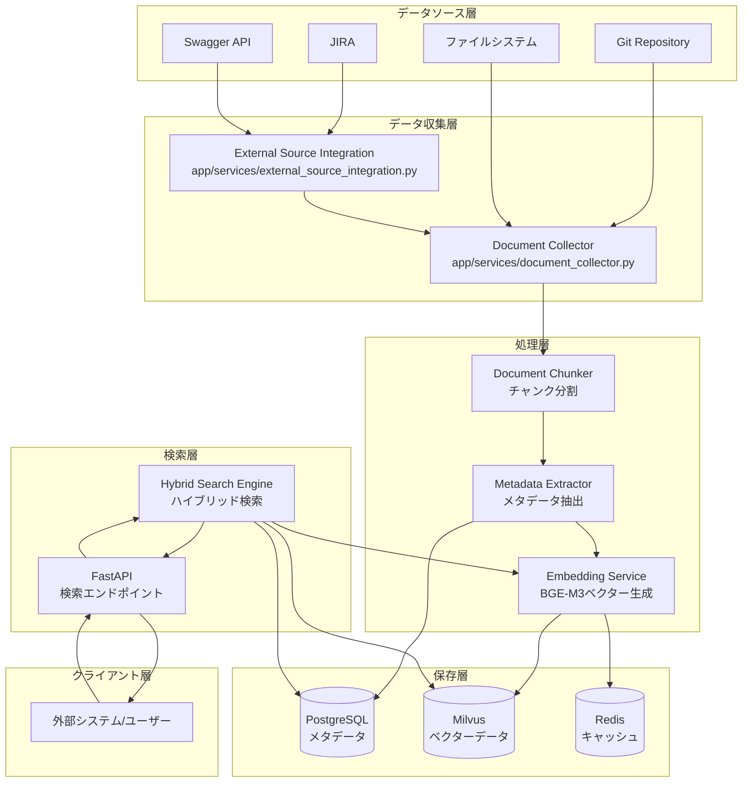
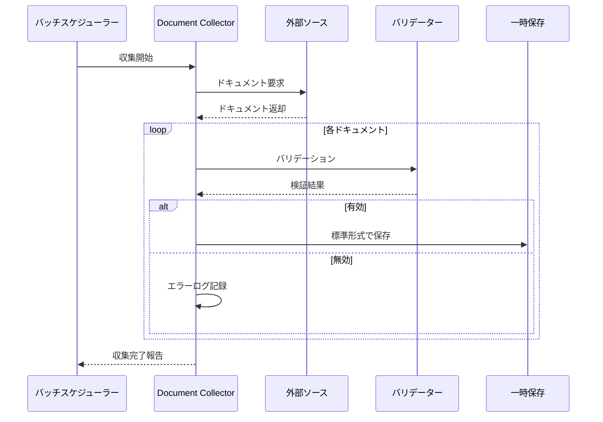
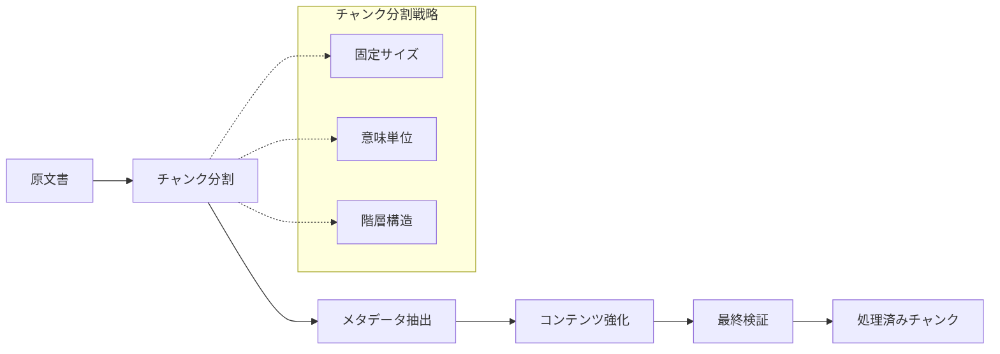
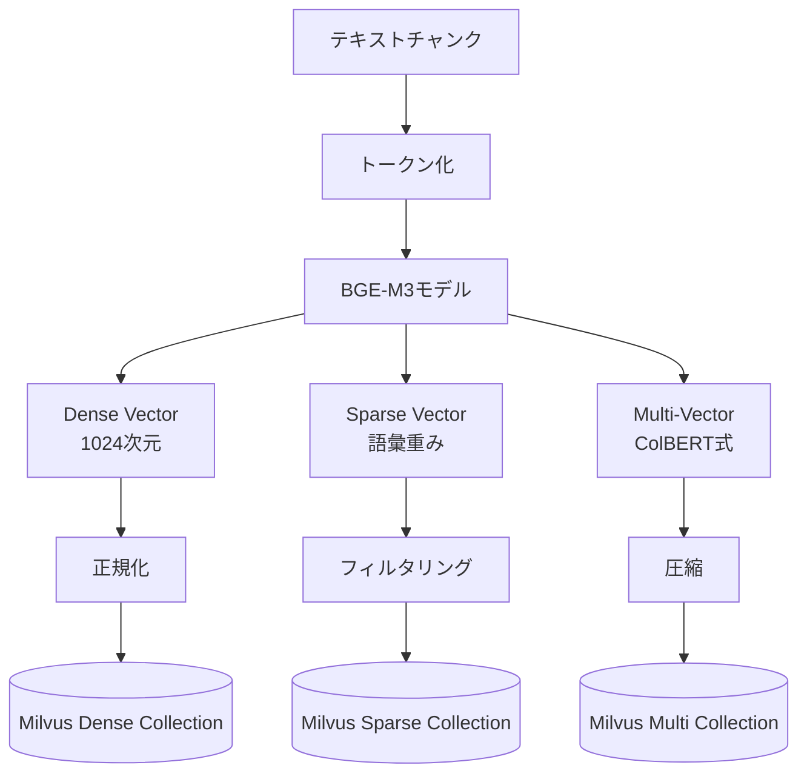
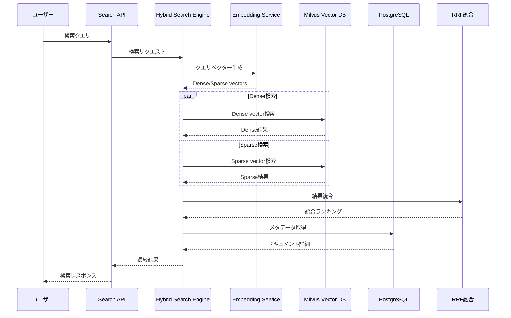
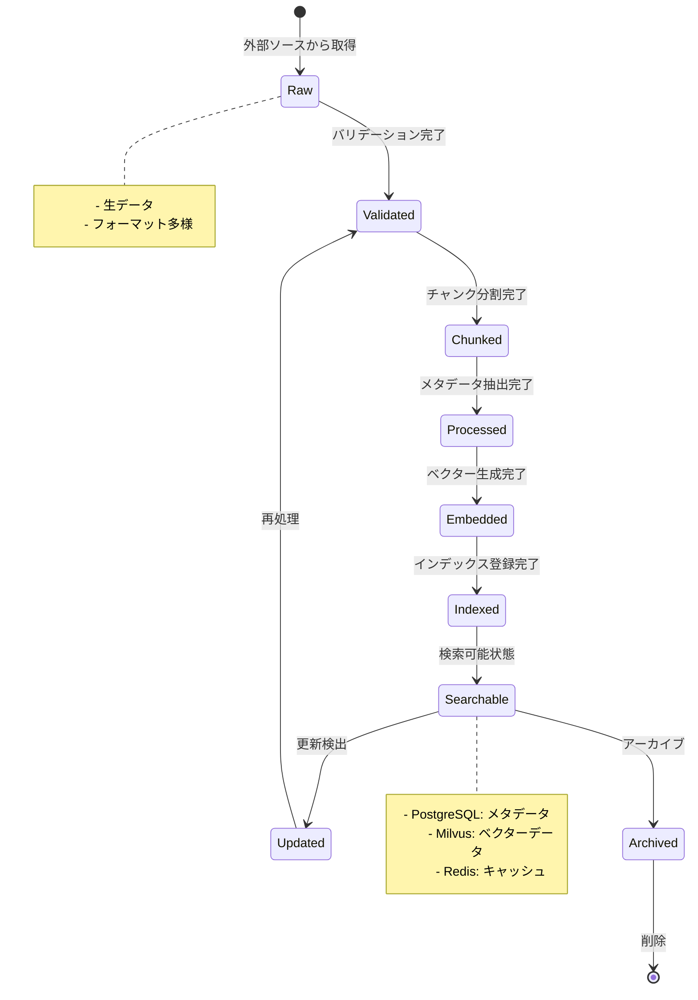

# Step01: データフローとライフサイクル

## 🎯 この章の目標

RAGシステム内でのデータの流れとライフサイクルを詳細に理解し、各段階での処理内容と関係性を把握する

---

## 📋 概要

このシステムでは、外部ソースから取得したドキュメントが複数の段階を経て検索可能な状態になり、最終的にユーザーに提供されます。このプロセス全体を **データフロー** として理解することが、システム運用・トラブルシューティングの鍵となります。

---

## 🔄 データフローの全体像



---

## 📝 主要なデータフロー詳細

### 1. ドキュメント収集フロー

#### 🎯 目的（ドキュメント収集フロー）

外部ソースシステムから生のドキュメントデータを取得し、システム内で処理可能な形式に標準化する

#### 📂 関連ファイル（ドキュメント収集フロー）

- `app/services/document_collector.py` - メイン収集ロジック
- `app/services/external_source_integration.py` - 外部システム連携

#### 🔄 処理ステップ（ドキュメント収集フロー）



#### 📊 データ変換例

**入力 (Git)**:

```json
{
  "id": "git123",
  "title": "API仕様書",
  "content": "# API仕様書\n\n## 概要...",
  "author": "developer@example.com",
  "updated": "2024-01-01T10:00:00Z"
}
```

**出力 (標準形式)**:

```json
{
  "id": "hash_of_git123",
  "title": "API仕様書",
  "content": "プレーンテキスト化されたコンテンツ",
  "source_type": "git",
  "source_id": "git123",
  "metadata": {
    "author": "developer@example.com",
    "updated_at": "2024-01-01T10:00:00Z",
    "word_count": 1500,
    "char_count": 9800
  }
}
```

### 2. ドキュメント処理フロー

#### 🎯 目的（ドキュメント処理フロー）

標準化されたドキュメントをチャンクに分割し、メタデータを抽出して検索しやすい形式に変換する

#### 📂 関連ファイル（ドキュメント処理フロー）

- `app/services/document_chunker.py` - チャンク分割
- `app/services/metadata_extractor.py` - メタデータ抽出
- `app/services/document_processing_service.py` - 統合処理

#### 🔄 処理ステップ（ドキュメント処理フロー）



#### 📊 チャンク分割例

**原文書**:

```text
# API仕様書
このAPIは...

## 認証
認証方式は...

## エンドポイント一覧
### GET /users
ユーザー一覧を取得...
```

**分割後チャンク**:

```json
[
  {
    "chunk_id": "chunk_001",
    "content": "# API仕様書\nこのAPIは...",
    "chunk_type": "header",
    "position": 0,
    "metadata": {
      "section": "introduction",
      "hierarchy_level": 1
    }
  },
  {
    "chunk_id": "chunk_002",
    "content": "## 認証\n認証方式は...",
    "chunk_type": "section",
    "position": 1,
    "metadata": {
      "section": "authentication",
      "hierarchy_level": 2
    }
  }
]
```

### 3. ベクター生成フロー

#### 🎯 目的（ベクター生成フロー）

BGE-M3モデルを使用して、テキストチャンクから3種類のベクター（Dense/Sparse/Multi-Vector）を生成する

#### 📂 関連ファイル（ベクター生成フロー）

- `app/services/embedding_service.py` - BGE-M3埋め込みサービス

#### 🔄 処理ステップ（ベクター生成フロー）



#### 📊 ベクター生成例

**入力テキスト**:

```text
"FastAPIを使用した認証システムの実装方法について説明します"
```

**出力ベクター**:

```json
{
  "dense_vector": [0.1, -0.3, 0.7, ...], // 1024次元
  "sparse_vector": {
    "認証": 0.8,
    "FastAPI": 0.6,
    "実装": 0.4,
    "システム": 0.3
  },
  "multi_vector": [
    [0.2, -0.1, ...], // トークン1
    [0.3, 0.5, ...],  // トークン2
    // ...
  ]
}
```

### 4. 検索フロー

#### 🎯 目的（検索フロー）

ユーザーのクエリに対して、ハイブリッド検索により最も関連性の高いドキュメントを返却する

#### 📂 関連ファイル（検索フロー）

- `app/services/hybrid_search_engine.py` - ハイブリッド検索エンジン
- `app/api/search.py` - 検索API

#### 🔄 処理ステップ（検索フロー）



---

## 🗃️ データの状態遷移

### ドキュメントライフサイクル



### データ整合性の確保

| 状態 | PostgreSQL | Milvus | Redis | 説明 |
|------|------------|--------|-------|------|
| **Raw** | ❌ | ❌ | ❌ | 収集直後の生データ |
| **Validated** | ⚠️ (temp) | ❌ | ❌ | 一時保存での検証中 |
| **Chunked** | ⚠️ (temp) | ❌ | ❌ | チャンク分割済み |
| **Processed** | ✅ | ❌ | ❌ | メタデータのみ保存 |
| **Embedded** | ✅ | ✅ | ⚠️ | ベクター生成完了 |
| **Searchable** | ✅ | ✅ | ✅ | 完全に検索可能 |

---

## ⚡ パフォーマンス考慮事項

### バッチ処理 vs リアルタイム処理

#### バッチ処理 (推奨)

```python
# 大量データの効率的処理
CollectionConfig(
    batch_size=100,        # 100件ずつ処理
    max_concurrent=3,      # 3並行実行
    timeout=300           # 5分タイムアウト
)
```

#### リアルタイム処理

```python
# 即座の反映が必要な場合
CollectionConfig(
    batch_size=1,         # 1件ずつ即座に
    max_concurrent=1,     # 順次処理
    timeout=30           # 30秒タイムアウト
)
```

### ボトルネック対策

| 処理段階 | 一般的なボトルネック | 対策 |
|----------|-------------------|------|
| **収集** | 外部API制限 | レート制限、リトライ機構 |
| **チャンク分割** | CPU集約的処理 | 並行処理、適切なチャンクサイズ |
| **ベクター生成** | GPU/CPU使用率 | バッチサイズ調整、GPU活用 |
| **インデックス登録** | Milvus書き込み | バルク挿入、インデックス最適化 |
| **検索** | 同時検索リクエスト | 接続プール、キャッシング |

---

## ❗ よくある落とし穴と対策

### 1. データ不整合

**問題**: PostgreSQLとMilvusのデータが同期しない

```python
# 悪い例: 分離したトランザクション
await postgres_repo.save_document(doc)
await milvus_client.insert_vector(vector)  # 失敗時、不整合発生
```

**対策**: 分散トランザクションまたは補償処理

```python
# 良い例: 補償処理付きトランザクション
try:
    doc_id = await postgres_repo.save_document(doc)
    vector_id = await milvus_client.insert_vector(vector)
    await redis_cache.set_mapping(doc_id, vector_id)
except Exception:
    # ロールバック処理
    await postgres_repo.delete_document(doc_id)
    await milvus_client.delete_vector(vector_id)
    raise
```

### 2. メモリリーク

**問題**: 大量ドキュメント処理時のメモリ不足

```python
# 悪い例: 全データをメモリに保持
all_documents = await collector.fetch_all_documents()  # OOM Risk!
for doc in all_documents:
    await process_document(doc)
```

**対策**: ストリーミング処理

```python
# 良い例: ジェネレーターを使用
async for doc_batch in collector.stream_documents(batch_size=100):
    await process_batch(doc_batch)
    # バッチ終了後にメモリ解放
```

### 3. ベクター次元不一致

**問題**: 異なるモデルバージョンによる次元数の差異

```python
# 検証: ベクター次元チェック
if len(dense_vector) != 1024:
    raise ValueError(f"Expected 1024 dimensions, got {len(dense_vector)}")
```

---

## 🎯 理解確認のための設問

### 基本理解

1. ドキュメントが検索可能になるまでの5つの主要段階を順番に列挙してください
2. BGE-M3が生成する3種類のベクターがそれぞれどのような検索に適しているか説明してください
3. ハイブリッド検索におけるRRF（Reciprocal Rank Fusion）の役割を説明してください

### 実装理解

1. `document_collector.py`で並行処理数が制限されている理由を説明してください
2. チャンク分割時に考慮すべき3つの戦略とそれぞれの利点を述べてください
3. データ整合性を保つために実装されている仕組みを2つ挙げてください

### 運用理解

1. システムのパフォーマンスボトルネックになりやすい3つの段階と対策を説明してください
2. 新しいドキュメントタイプを追加する際に変更が必要なファイルを特定してください
3. 検索結果の品質が低下した場合の調査手順を段階別に説明してください

### トラブルシューティング

1. PostgreSQLにメタデータはあるがMilvusにベクターがない場合の原因と対処法
2. 同じクエリの検索結果が毎回異なる場合の考えられる原因
3. 埋め込み処理が異常に遅い場合の診断ポイント

---

## 📚 次のステップ

データフローを理解できたら、次の学習段階に進んでください：

- **Step02**: API層の設計と実装 - FastAPIエンドポイントの詳細
- **Step03**: ベクター検索エンジンの仕組み - BGE-M3とハイブリッド検索の内部実装
- **Step04**: 認証・認可システム - JWT・API Key認証の実装
- **Step05**: データモデル設計 - PostgreSQL・Milvusのスキーマ詳細

各ステップでデータがどのように変換・活用されるかを意識しながら学習を進めてください。
