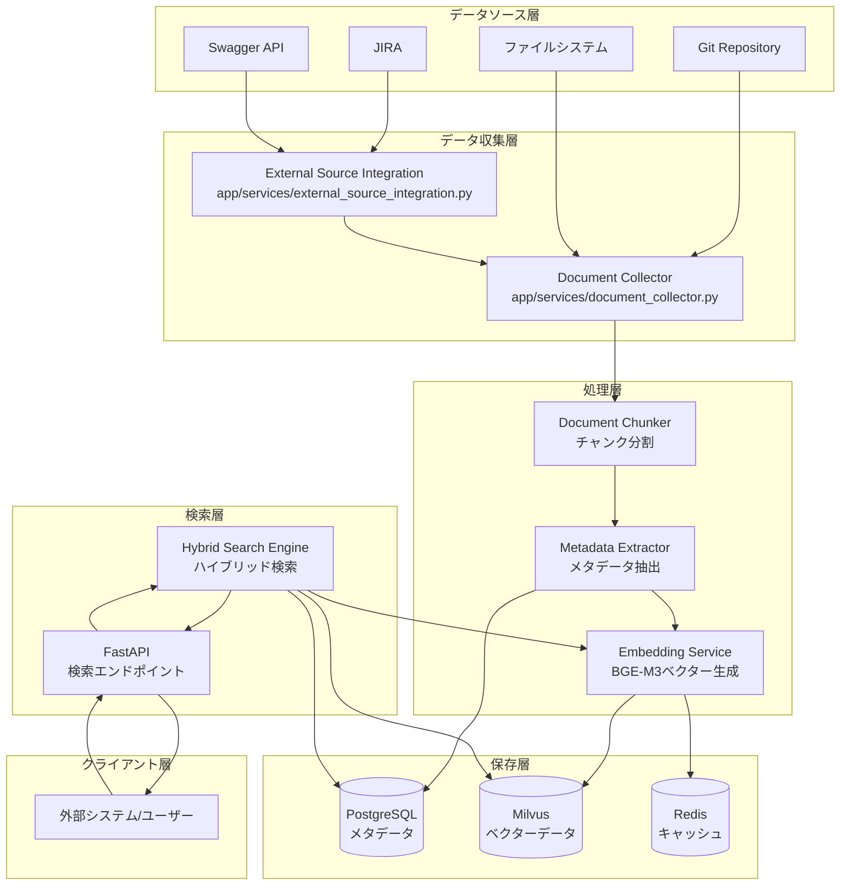
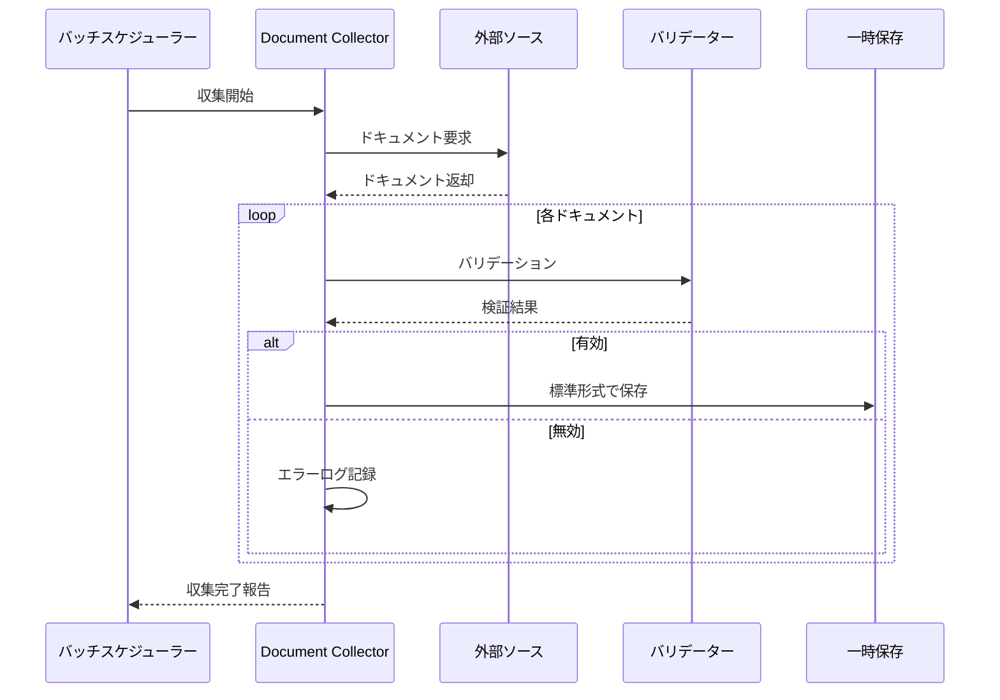
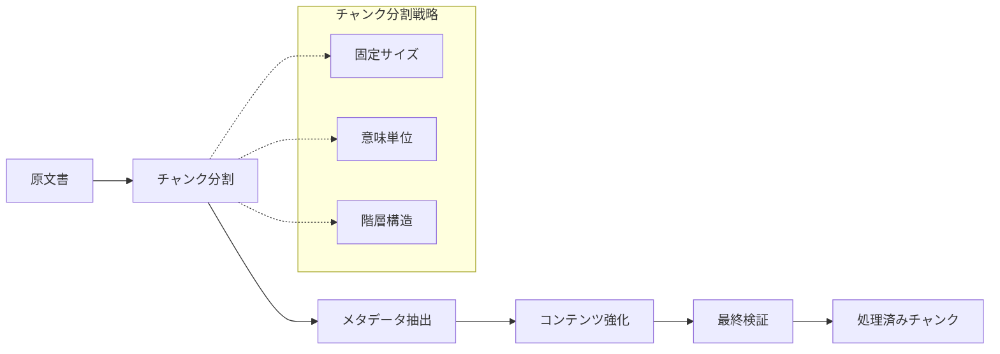
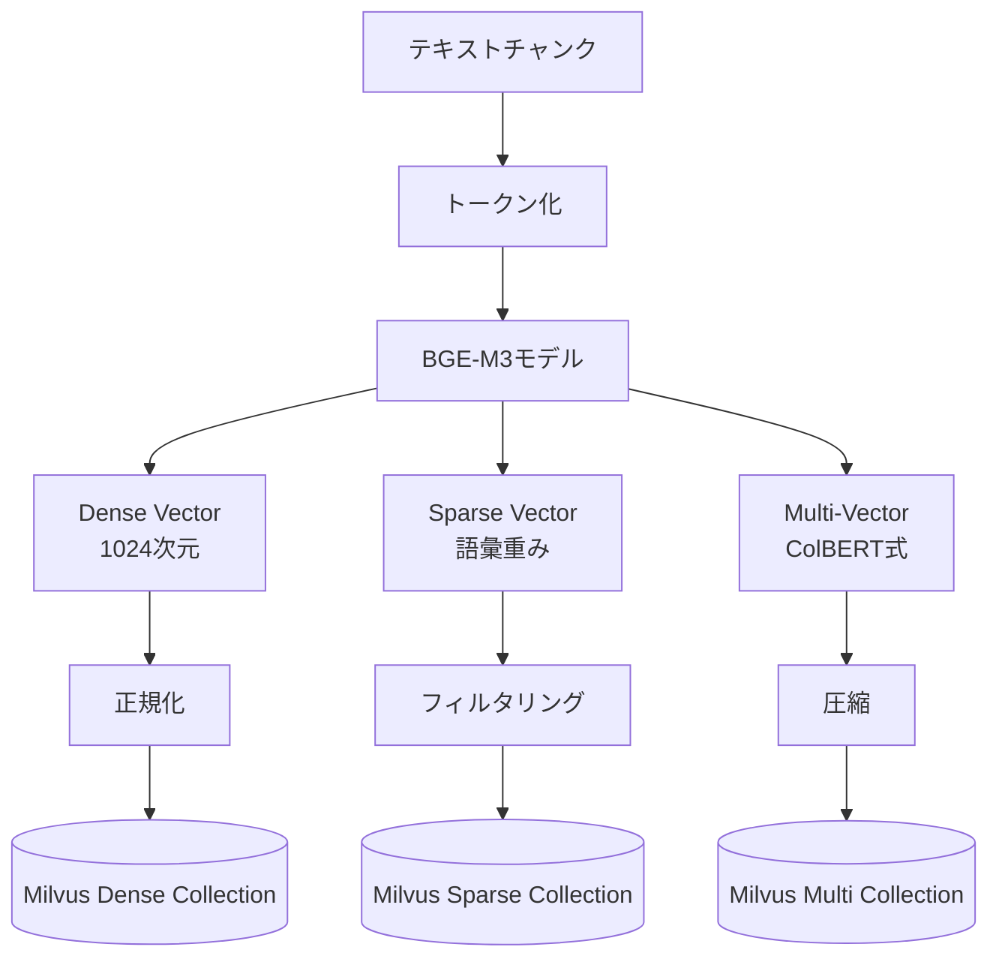
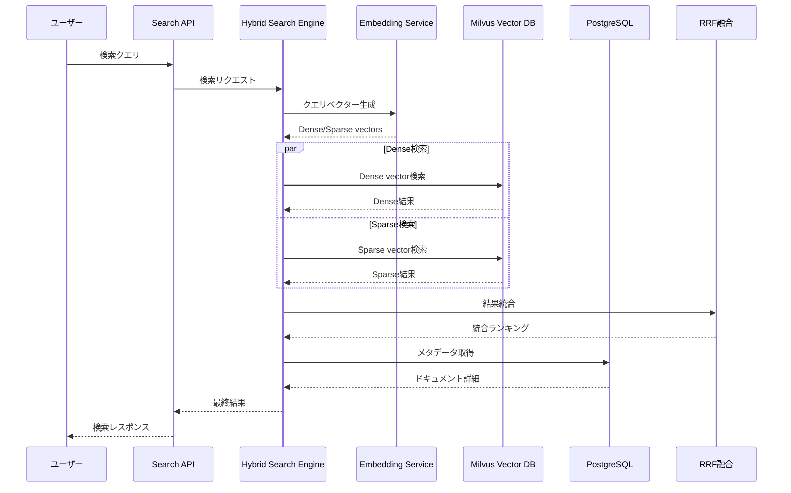
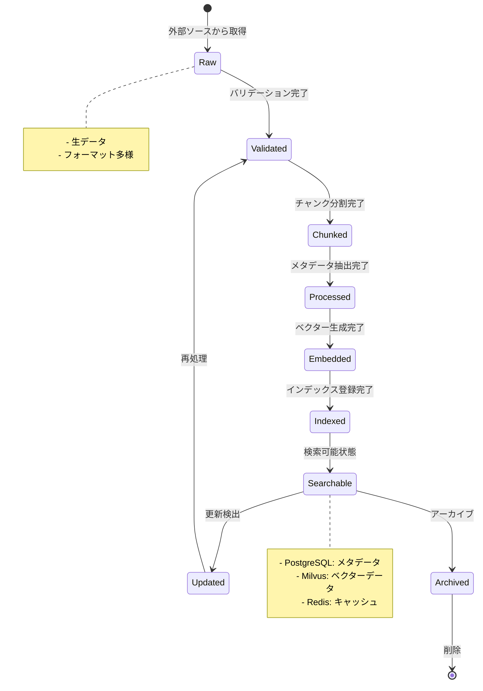

# Step01: データフローとライフサイクル

## 🎯 この章の目標

RAGシステム内でのデータの流れとライフサイクルを詳細に理解し、各段階での処理内容と関係性を把握する

---

## 📋 概要

このシステムでは、外部ソースから取得したドキュメントが複数の段階を経て検索可能な状態になり、最終的にユーザーに提供されます。このプロセス全体を **データフロー** として理解することが、システム運用・トラブルシューティングの鍵となります。

---

## 🔄 データフローの全体像



---

## 📝 主要なデータフロー詳細

### 1. ドキュメント収集フロー

#### 🎯 目的（ドキュメント収集フロー）

外部ソースシステムから生のドキュメントデータを取得し、システム内で処理可能な形式に標準化する

#### 📂 関連ファイル（ドキュメント収集フロー）

**実装ファイル**:

- `../../app/services/document_collector.py` - メイン収集ロジック
- `../../app/services/external_source_integration.py` - 外部システム連携

**DocumentCollectorサービスの設計思想**:

DocumentCollectorは、様々な外部ソースからドキュメントを収集し、統一フォーマットに変換する中核サービスです。

**主要機能**:

1. **ソース別アダプター**: Git、JIRA、Swagger等それぞれに特化したアダプターを実装
2. **並行処理制御**: 外部APIのレート制限を考慮した並行処理数の制御
3. **エラーハンドリング**: 一時的な障害に対するリトライメカニズム
4. **変換パイプライン**: 各ソースの独自フォーマットを標準形式に変換

**バリデーション機能**:

- 必須フィールドの確認
- 文書サイズの上限チェック
- 文字エンコーディングの正規化
- 重複ドキュメントの検出

#### 🔄 処理ステップ（ドキュメント収集フロー）



#### 📊 データ変換例

**入力 (Git)**:

```json
{
  "id": "git123",
  "title": "API仕様書",
  "content": "# API仕様書\n\n## 概要...",
  "author": "developer@example.com",
  "updated": "2024-01-01T10:00:00Z"
}
```

**出力 (標準形式)**:

```json
{
  "id": "hash_of_git123",
  "title": "API仕様書",
  "content": "プレーンテキスト化されたコンテンツ",
  "source_type": "git",
  "source_id": "git123",
  "metadata": {
    "author": "developer@example.com",
    "updated_at": "2024-01-01T10:00:00Z",
    "word_count": 1500,
    "char_count": 9800
  }
}
```

### 2. ドキュメント処理フロー

#### 🎯 目的（ドキュメント処理フロー）

標準化されたドキュメントをチャンクに分割し、メタデータを抽出して検索しやすい形式に変換する

#### 📂 関連ファイル（ドキュメント処理フロー）

**実装ファイル**:

- `../../app/services/document_chunker.py` - チャンク分割
- `../../app/services/metadata_extractor.py` - メタデータ抽出
- `../../app/services/document_processing_service.py` - 統合処理

**DocumentChunkerの分割戦略**:

1. **固定サイズ分割**:
   - 設定可能なトークン数（デフォルト1000）で均等分割
   - オーバーラップ（デフォルト200トークン）で文脈の連続性を保持
   - 技術文書やAPIドキュメントに最適

2. **意味単位分割**:
   - 見出しやセクション境界を認識して分割
   - 階層構造を保持したチャンク生成
   - ユーザーマニュアルや仕様書に最適

3. **階層構造分割**:
   - ドキュメントの論理構造を解析
   - 親子関係を持つチャンクツリーを構築
   - 大規模なドキュメントの効率的な検索に有効

**MetadataExtractorの抽出項目**:

- タイトル、著者、更新日時
- カテゴリ、タグ、言語
- 文字数、単語数、読了時間推定
- 技術用語、固有名詞の抽出

#### 🔄 処理ステップ（ドキュメント処理フロー）



#### 📊 チャンク分割例

**原文書**:

```text
# API仕様書
このAPIは...

## 認証
認証方式は...

## エンドポイント一覧
### GET /users
ユーザー一覧を取得...
```

**分割後チャンク**:

```json
[
  {
    "chunk_id": "chunk_001",
    "content": "# API仕様書\nこのAPIは...",
    "chunk_type": "header",
    "position": 0,
    "metadata": {
      "section": "introduction",
      "hierarchy_level": 1
    }
  },
  {
    "chunk_id": "chunk_002",
    "content": "## 認証\n認証方式は...",
    "chunk_type": "section",
    "position": 1,
    "metadata": {
      "section": "authentication",
      "hierarchy_level": 2
    }
  }
]
```

### 3. ベクター生成フロー

#### 🎯 目的（ベクター生成フロー）

BGE-M3モデルを使用して、テキストチャンクから3種類のベクター（Dense/Sparse/Multi-Vector）を生成する

#### 📂 関連ファイル（ベクター生成フロー）

**実装ファイル**: `../../app/services/embedding_service.py` - BGE-M3埋め込みサービス

**EmbeddingServiceの実装詳細**:

BGE-M3モデルを使用して、高品質なマルチモーダル埋め込みを生成するサービスです。

**3種類のベクトル生成**:

1. **Dense Vector（密ベクトル）**:
   - 1024次元の連続値ベクトル
   - セマンティック（意味的）類似性の検索に最適
   - コサイン類似度で比較
   - 「同じ意味の異なる表現」を発見可能

2. **Sparse Vector（疎ベクトル）**:
   - 重要語彙とその重みのマッピング
   - キーワードベースの精密検索に最適
   - BM25に似た語彙重要度スコアリング
   - 技術用語やエラーコードの完全一致検索に有効

3. **Multi-Vector（ColBERT式）**:
   - 各トークンに独立したベクトルを生成
   - きめ細かい文脈マッチングが可能
   - 長文ドキュメントの部分一致検索に有効
   - 計算コストは高いが最高精度

**パフォーマンス最適化**:

- バッチ処理による効率化（最大32文書同時処理）
- GPU使用時の自動検出と最適化
- メモリ効率的なストリーミング処理
- キャッシュによる重複計算の削減

#### 🔄 処理ステップ（ベクター生成フロー）



#### 📊 ベクター生成例

**入力テキスト**:

```text
"FastAPIを使用した認証システムの実装方法について説明します"
```

**出力ベクター**:

```json
{
  "dense_vector": [0.1, -0.3, 0.7, ...], // 1024次元
  "sparse_vector": {
    "認証": 0.8,
    "FastAPI": 0.6,
    "実装": 0.4,
    "システム": 0.3
  },
  "multi_vector": [
    [0.2, -0.1, ...], // トークン1
    [0.3, 0.5, ...],  // トークン2
    // ...
  ]
}
```

### 4. 検索フロー

#### 🎯 目的（検索フロー）

ユーザーのクエリに対して、ハイブリッド検索により最も関連性の高いドキュメントを返却する

#### 📂 関連ファイル（検索フロー）

**実装ファイル**:

- `../../app/services/hybrid_search_engine.py` - ハイブリッド検索エンジン
- `../../app/api/search.py` - 検索API

**HybridSearchEngineの設計思想**:

セマンティック検索とキーワード検索の長所を組み合わせた高精度な検索を実現します。

**RRF（Reciprocal Rank Fusion）アルゴリズム**:

```plaintext
RRFスコア = Σ 1 / (k + rank_i)
```

- k: 定数（デフォルト60）でランキングの平滑化を制御
- rank_i: 各検索方式でのランク順位
- 複数の検索結果を公平に統合

**検索モードの使い分け**:

1. **ハイブリッドモード（デフォルト）**:
   - Dense: 70%、Sparse: 30%の重み付け
   - 一般的な検索クエリに最適
   - 意味と語彙の両方を考慮

2. **セマンティックモード**:
   - Dense: 100%の重み
   - 「似た意味」の文書を発見
   - 自然言語の質問に有効

3. **キーワードモード**:
   - Sparse: 100%の重み
   - 技術用語の完全一致
   - エラーコードやAPI名の検索に有効

**検索パイプライン**:

1. クエリの前処理（正規化、トークン化）
2. クエリベクトルの生成
3. 並列ベクトル検索の実行
4. 結果の統合とランキング
5. メタデータの付与
6. ファセット情報の生成

#### 🔄 処理ステップ（検索フロー）



---

## 🗃️ データの状態遷移

### ドキュメントライフサイクル



### データ整合性の確保

| 状態 | PostgreSQL | Milvus | Redis | 説明 |
|------|------------|--------|-------|------|
| **Raw** | ❌ | ❌ | ❌ | 収集直後の生データ |
| **Validated** | ⚠️ (temp) | ❌ | ❌ | 一時保存での検証中 |
| **Chunked** | ⚠️ (temp) | ❌ | ❌ | チャンク分割済み |
| **Processed** | ✅ | ❌ | ❌ | メタデータのみ保存 |
| **Embedded** | ✅ | ✅ | ⚠️ | ベクター生成完了 |
| **Searchable** | ✅ | ✅ | ✅ | 完全に検索可能 |

---

## ⚡ パフォーマンス考慮事項

### バッチ処理 vs リアルタイム処理

**設定ファイル**: `../../app/core/config.py` (CollectionConfig)

#### バッチ処理 (推奨)

**バッチ処理の利点**:

- **効率性**: 大量データを一括処理することでオーバーヘッドを削減
- **リソース最適化**: GPU/CPUの利用効率を最大化
- **エラー耐性**: 部分的な失敗でも継続処理可能
- **コスト削減**: 外部APIの呼び出し回数を最小化

**推奨設定**:

- batch_size: 100（メモリと処理速度のバランス）
- max_concurrent: 3（外部APIのレート制限を考慮）
- timeout: 300秒（大量データ処理に十分な時間）

#### リアルタイム処理

**リアルタイム処理の利点**:

- **即時性**: データ登録後すぐに検索可能
- **単純性**: エラー処理がシンプル
- **監視性**: 個別の処理状況を追跡しやすい

**推奨設定**:

- batch_size: 1（即座に処理）
- max_concurrent: 1（順次処理で予測可能）
- timeout: 30秒（単一文書の処理には十分）

### ボトルネック対策

| 処理段階 | 一般的なボトルネック | 対策 |
|----------|-------------------|------|
| **収集** | 外部API制限 | レート制限、リトライ機構 |
| **チャンク分割** | CPU集約的処理 | 並行処理、適切なチャンクサイズ |
| **ベクター生成** | GPU/CPU使用率 | バッチサイズ調整、GPU活用 |
| **インデックス登録** | Milvus書き込み | バルク挿入、インデックス最適化 |
| **検索** | 同時検索リクエスト | 接続プール、キャッシング |

---

## ❗ よくある落とし穴と対策

### 1. データ不整合

**問題**: PostgreSQLとMilvusのデータが同期しない

**対策実装**: `../../app/services/transaction_manager.py`

**Sagaパターンによる分散トランザクション**:

分散システムでのデータ整合性を保つため、Sagaパターンを実装しています。

**実装の要点**:

1. **補償可能トランザクション**:
   - 各操作に対応する取り消し処理を定義
   - 失敗時は逆順で補償処理を実行
   - 最終的整合性を保証

2. **状態管理**:
   - 各ステップの成功/失敗を記録
   - 中断された処理の再開が可能
   - 監査ログとして利用可能

3. **エラーハンドリング**:
   - 一時的エラーは自動リトライ
   - 永続的エラーは補償処理を実行
   - デッドレターキューで処理不能データを隔離

**トランザクションの流れ**:

1. PostgreSQLにメタデータ保存（status: 'processing'）
2. Milvusにベクトル保存
3. Redisにマッピング情報保存
4. PostgreSQLのステータス更新（status: 'completed'）
5. 失敗時は逆順で削除処理

### 2. メモリリーク

**問題**: 大量ドキュメント処理時のメモリ不足

**対策実装**: `../../app/services/stream_processor.py`

**ストリーミング処理の設計**:

大量データを効率的に処理するため、メモリ効率的なストリーミングアーキテクチャを採用しています。

**実装の特徴**:

1. **非同期ジェネレーター**:
   - データを小さなチャンクで逐次処理
   - メモリ使用量を一定に保持
   - バックプレッシャー機構で過負荷を防止

2. **バッチウィンドウ**:
   - 設定可能なバッチサイズ（デフォルト100）
   - メモリ使用量の上限設定
   - 処理完了後の即座なガベージコレクション

3. **リソース監視**:
   - メモリ使用量の継続的モニタリング
   - 閾値超過時の自動スロットリング
   - メトリクスとアラートの統合

**ベストプラクティス**:

- コンテキストマネージャーで確実なリソース解放
- 大きなオブジェクトの参照を早期に削除
- 処理済みデータの積極的なガベージコレクション

### 3. ベクター次元不一致

**問題**: 異なるモデルバージョンによる次元数の差異

**対策実装**: `../../app/services/vector_validator.py`

**ベクトル検証システム**:

モデルバージョンの変更やバグによるベクトル次元の不一致を防ぐため、多層的な検証システムを実装しています。

**検証レイヤー**:

1. **生成時検証**:
   - BGE-M3の期待次元数（1024）との一致確認
   - ベクトル値の範囲チェック（-1.0 ~ 1.0）
   - NaN/Inf値の検出と処理

2. **保存前検証**:
   - Milvusコレクションスキーマとの整合性確認
   - 正規化の確認（L2ノルム = 1）
   - データ型の一致確認

3. **定期検証**:
   - 既存データの整合性チェック
   - 異常なベクトルの検出とレポート
   - 自動修復または再生成のトリガー

**モデル移行戦略**:

- バージョン情報のメタデータ保存
- 段階的な移行サポート
- 後方互換性の維持

---

## 🎯 理解確認のための設問

### 基本理解

1. ドキュメントが検索可能になるまでの5つの主要段階を順番に列挙してください
2. BGE-M3が生成する3種類のベクターがそれぞれどのような検索に適しているか説明してください
3. ハイブリッド検索におけるRRF（Reciprocal Rank Fusion）の役割を説明してください

### 実装理解

1. `document_collector.py`で並行処理数が制限されている理由を説明してください
2. チャンク分割時に考慮すべき3つの戦略とそれぞれの利点を述べてください
3. データ整合性を保つために実装されている仕組みを2つ挙げてください

### 運用理解

1. システムのパフォーマンスボトルネックになりやすい3つの段階と対策を説明してください
2. 新しいドキュメントタイプを追加する際に変更が必要なファイルを特定してください
3. 検索結果の品質が低下した場合の調査手順を段階別に説明してください

### トラブルシューティング

1. PostgreSQLにメタデータはあるがMilvusにベクターがない場合の原因と対処法
2. 同じクエリの検索結果が毎回異なる場合の考えられる原因
3. 埋め込み処理が異常に遅い場合の診断ポイント

---

## 📚 次のステップ

データフローを理解できたら、次の学習段階に進んでください：

- **Step02**: API層の設計と実装 - FastAPIエンドポイントの詳細
- **Step03**: ベクター検索エンジンの仕組み - BGE-M3とハイブリッド検索の内部実装
- **Step04**: 認証・認可システム - JWT・API Key認証の実装
- **Step05**: データモデル設計 - PostgreSQL・Milvusのスキーマ詳細

各ステップでデータがどのように変換・活用されるかを意識しながら学習を進めてください。
