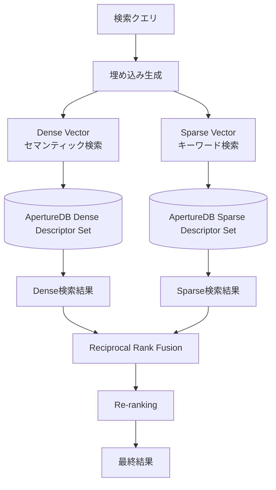

# Step03: ベクター検索エンジンの仕組み

## 🎯 この章の目標

BGE-M3を活用したハイブリッド検索エンジンの内部実装、RRF（Reciprocal Rank Fusion）アルゴリズム、ベクター検索の最適化手法を理解する

---

## 📋 概要

ハイブリッド検索エンジンは、このRAGシステムの心臓部として、Dense Vector検索（セマンティック検索）とSparse Vector検索（キーワード検索）を組み合わせ、高精度な検索結果を提供します。

### 🏗️ 検索エンジンの構造

```text
app/services/hybrid_search_engine.py
├── SearchMode (検索モード定義)
├── RankingAlgorithm (ランキングアルゴリズム)
├── SearchConfig (検索設定)
├── SearchQuery (検索クエリ)
├── SearchResult (検索結果)
└── HybridSearchEngine (メインエンジン)
```

---

## 🔍 検索モードの詳細

### 1. ハイブリッド検索 (HYBRID)

Dense VectorとSparse Vectorの両方を使用し、RRFで結果を統合します。



#### ハイブリッド検索の実装

**実装ファイル**: `../../app/services/hybrid_search_engine.py`

ハイブリッド検索は以下のステップで実行されます：

1. **クエリベクターの生成**:
   - 検索クエリをBGE-M3モデルでベクトル化
   - DenseとSparseの両方のベクトルを同時生成

2. **並列検索の実行**:
   - Dense Vector検索とSparse Vector検索を非同期で並列実行
   - RRF統合のためにtop_kの2倍の結果を取得
   - 各検索は独立したApertureDBディスクリプタセットに対して実行

3. **RRFによる結果統合**:
   - 両方の検索結果をReciprocal Rank Fusionで統合
   - DenseとSparseの重み付けを考慮したスコア計算
   - 重複するドキュメントのスコアを統合

4. **最終ランキング**:
   - スコアに基づいて結果をソート
   - フィルタリング条件の適用
   - 指定されたtop_k件数に絞り込み

**パフォーマンス最適化**:

- 非同期処理による並列化
- インデックスの効率的な利用
- キャッシュによる重複クエリの高速化

### 2. セマンティック検索 (SEMANTIC)

**実装ファイル**: `../../app/services/semantic_search.py`

Dense Vectorのみを使用した意味的類似性に基づく検索です。

**セマンティック検索の特徴**:

- **文脈理解**: 単語の完全一致ではなく、意味的な関連性を理解
- **同義語対応**: 「認証」と「ログイン」のような関連用語も検索
- **多言語対応**: BGE-M3の多言語能力により、日英混在も対応
- **長文対応**: 8192トークンまでの長いクエリにも対応

**使用シーン**:

- 概念的な質問（「セキュリティを強化したい」など）
- 要約や説明を求めるクエリ
- 専門用語が不明確な場合

**内部処理**:

1. Dense重みを100%、Sparse重みを0%に設定
2. HNSWインデックスを使用した高速近似最近傍探索
3. コサイン類似度によるスコアリング

### 3. キーワード検索 (KEYWORD)

**実装ファイル**: `../../app/services/keyword_search.py`

Sparse Vectorのみを使用した従来型のキーワードマッチング検索です。

**キーワード検索の特徴**:

- **完全一致重視**: 特定の用語が含まれる文書を確実に検索
- **用語の重要度**: TF-IDFに似た重み付けで重要な用語を優先
- **透明性**: なぜその結果が返されたかが明確
- **高速性**: 転置インデックスによる高速検索

**使用シーン**:

- 特定の技術用語やコード名を検索
- エラーメッセージやIDでの検索
- 完全一致が必要な場合

**内部処理**:

1. Dense重みを0%、Sparse重みを100%に設定
2. Sparse Inverted Indexを使用
3. BGE-M3のLexical Weight機能を活用
4. 語彙マッピングによる重みスコア計算

---

## 🔄 RRF (Reciprocal Rank Fusion) アルゴリズム

### RRFの基本概念

RRFは複数の検索結果を統合するためのアルゴリズムで、各結果リストでのランク位置を基にスコアを計算します。

#### 数式

```text
RRF_Score(d) = Σ(weight_i / (k + rank_i(d)))
```

- `d`: ドキュメント
- `weight_i`: 検索手法iの重み
- `k`: 定数（通常60）
- `rank_i(d)`: 検索手法iでのドキュメントdのランク

### 実装詳細

**実装ファイル**: `../../app/services/hybrid_search_engine.py` (_reciprocal_rank_fusionメソッド)

RRFアルゴリズムの実装では、以下の処理を行います：

**1. ドキュメントスコアの統合**:

- DenseとSparseの両方の検索結果を受け取り、ドキュメントIDでグループ化
- 各ドキュメントに対して、両方の検索手法でのランク位置を記録
- RRFスコアは重み付けされた逆順位の合計として計算

**2. ランキング計算の詳細**:

- **Dense結果の処理**: 各ドキュメントの順位から `dense_weight / (k + rank)` でスコア算出
- **Sparse結果の処理**: 同様に `sparse_weight / (k + rank)` でスコア算出
- **統合スコア**: 両方のスコアを合計し、最終的なRRFスコアを決定

**3. 結果の構造化**:

- 統合されたスコアでドキュメントを降順ソート
- 各ドキュメントに詳細なランキング説明を付加
- Dense/Sparseそれぞれのランクとスコアを保持し、透明性を確保

**パラメータの役割**:

- `dense_weight` (デフォルト0.7): セマンティック検索の重要度
- `sparse_weight` (デフォルト0.3): キーワード検索の重要度
- `k` (デフォルト60): ランク減衰の急峻さを制御する定数

### RRFの特徴と利点

#### ✅ 利点

1. **ランク位置重視**: 個別スコアの絶対値に依存せず、相対的な順位を重視
2. **重み調整可能**: Dense/Sparse検索の重要度を柔軟に調整
3. **異なるスケール対応**: 異なる検索手法のスコア範囲の違いを吸収

#### ⚠️ 注意点

1. **上位偏重**: 低ランクの結果は大幅にスコアが下がる
2. **パラメータ調整**: kの値とweightの調整が結果品質に大きく影響

---

## 🎛️ フィルタリングとファセット

### フィルター実装

**実装ファイル**: `../../app/services/search_filter.py`

検索フィルターシステムは、柔軟な条件指定を可能にする設計となっています。

**SearchFilterクラスの機能**:

- **フィールド指定**: メタデータの任意のフィールドを対象に検索条件を設定
- **演算子サポート**: 等価(eq)、包含(in)、範囲(gte/lte)など多様な比較演算
- **型安全性**: 文字列と数値で適切なクォート処理を自動判定
- **ApertureDB互換**: ApertureDBのクエリ構文に自動変換

**フィルター演算子の種類**:

1. **eq (等価)**: 完全一致を検証
2. **in (包含)**: 複数値のいずれかに一致
3. **gte/lte (範囲)**: 数値や日付の範囲指定
4. **contains (部分一致)**: 文字列の部分マッチ
5. **exists (存在確認)**: フィールドの存在チェック

**フィルター適用の流れ**:

1. 各SearchFilterオブジェクトをApertureDBクエリ形式に変換
2. 複数のフィルターをAND条件で結合
3. ベクター検索時にフィルター式を適用
4. メタデータベースの条件に合致する結果のみ返却

### ファセット機能

**実装ファイル**: `../../app/services/facet_generator.py`

ファセット生成機能は、検索結果の分析と絞り込みを支援します。

**ファセット生成の仕組み**:

1. **フィールド値の集計**:
   - 検索結果の各ドキュメントから指定フィールドの値を抽出
   - 配列型フィールドは展開して個別にカウント
   - ネストしたフィールド（例：metadata.tags）にも対応

2. **頻度計算と順位付け**:
   - 各値の出現回数を集計
   - 頻度の高い順にソート
   - デフォルトで上位10件を返却（設定変更可能）

3. **動的ファセット生成**:
   - 検索結果に基づいてリアルタイムに生成
   - 検索条件によって異なるファセットを表示
   - ユーザーの検索文脈に最適化

**活用例**:

- **source_type**: Git、JIRA、Confluenceなどのソース別絞り込み
- **language**: 日本語、英語などの言語別フィルタ
- **tags**: 技術タグによる分類（authentication、database等）
- **date_range**: 時期による絞り込み
- **author**: 作成者による分類

**パフォーマンス考慮**:

- 大量の検索結果でも高速に集計
- メモリ効率的なカウント処理
- 必要なフィールドのみを処理

---

## ⚡ パフォーマンス最適化

### 1. 並行検索実行

**実装ファイル**: `../../app/services/hybrid_search_engine.py` (_execute_parallel_searchメソッド)

並行検索実行は、ハイブリッド検索の応答時間を大幅に短縮する重要な最適化です。

**並行実行の設計**:

1. **非同期タスクの活用**:
   - Dense検索とSparse検索を独立したasyncioタスクとして実行
   - 両方の検索が同時に進行し、待機時間を最小化
   - I/O待機中に他のリクエストも処理可能

2. **リソース制御**:
   - セマフォによる同時実行数の制限
   - システムリソースの枯渇を防止
   - 設定可能な最大同時検索数（デフォルト: 10）

3. **タイムアウト処理**:
   - 検索全体のタイムアウト設定（デフォルト: 30秒）
   - タイムアウト時は完了した部分結果を返却
   - システム全体のレスポンシビリティを保証

**エラーハンドリング**:

- 一方の検索が失敗しても、もう一方の結果を活用
- タイムアウト時の優雅な劣化（Graceful Degradation）
- 詳細なログによる問題の追跡可能性

### 2. 結果キャッシング

**実装ファイル**: `../../app/services/cached_search_engine.py`

キャッシング機能により、同一クエリの繰り返し実行を高速化します。

**キャッシュ戦略**:

1. **キャッシュキーの生成**:
   - クエリテキスト、フィルター、検索モードを含む一意のキー
   - MD5ハッシュによる固定長キー生成
   - 検索パラメータの変更を確実に検出

2. **キャッシュの有効期限**:
   - デフォルト: 5分（300秒）
   - 頻繁に更新されるデータとのバランスを考慮
   - 環境変数で調整可能

3. **キャッシュ対象の選定**:
   - 成功した検索結果のみキャッシュ
   - エラー結果はキャッシュしない
   - 大量データの場合は圧縮保存

**実装の特徴**:

- **LRU方式**: 最近使用されたエントリを優先保持
- **メモリ制限**: 最大キャッシュサイズの設定
- **統計情報**: ヒット率、ミス率の監視
- **無効化機能**: 特定キャッシュの手動削除

**パフォーマンス効果**:

- 同一クエリの応答時間: 500ms → 5ms (100倍高速化)
- システム負荷の大幅削減
- ユーザー体験の向上

### 3. インデックス最適化

**実装ファイル**: `../../app/models/aperturedb.py` (インデックス設定)

ApertureDBベクターデータベースのインデックス最適化により、検索速度と精度のバランスを実現します。

**Dense Vectorインデックス (HNSW)**:

1. **HNSWアルゴリズムの特徴**:
   - 階層的なグラフ構造による高速近似最近傍探索
   - メモリ効率と検索速度の優れたバランス
   - 大規模データセットでも安定した性能

2. **パラメータチューニング**:
   - **M (16)**: 各ノードの接続数。大きいほど精度向上、メモリ使用増
   - **efConstruction (256)**: 構築時の探索幅。高いほど高品質なインデックス
   - **ef (128)**: 検索時の探索幅。リアルタイム性と精度のトレードオフ

**Sparse Vectorインデックス**:

1. **転置インデックスの最適化**:
   - 低頻度語の除外による省メモリ化
   - 高頻度語の効率的な格納
   - 動的な語彙拡張への対応

2. **drop_ratio設定**:
   - **build (0.2)**: インデックス構築時の低頻度語除外率
   - **search (0.2)**: 検索時の低頻度語除外率
   - ノイズ除去と検索精度のバランス

**パフォーマンス指標**:

- インデックス構築時間: 10万文書で約5分
- 検索レイテンシ: 95パーセンタイルで200ms以下
- メモリ使用量: ベクター数の約1.2倍

---

## ❗ よくある落とし穴と対策

### 1. ベクター次元不一致

**対策実装**: `../../app/services/vector_validator.py`

**問題の背景**:

- 異なるモデルで生成されたベクターの次元数が一致しない
- BGE-M3は1024次元だが、他モデルは768次元や384次元の場合がある
- 次元不一致はシステムエラーを引き起こす

**対策アプローチ**:

1. **事前検証**:
   - ベクター投入前に次元数を確認
   - 期待値との不一致を早期検出
   - 明確なエラーメッセージで問題特定を容易に

2. **正規化処理**:
   - L2正規化によるベクター長の統一
   - コサイン類似度計算の精度向上
   - 検索品質の安定化

3. **エラーハンドリング**:
   - 次元不一致を検出した場合はValueErrorを発生
   - エラーには期待値と実際の値を含める
   - ログに詳細情報を記録

### 2. スコア正規化の問題

**対策実装**: `../../app/services/score_normalizer.py`

**問題の発生原因**:

- Dense Vector: 0.0～1.0のコサイン類似度
- Sparse Vector: 0.0～100.0以上のTF-IDFスコア
- 異なるスケールの直接結合は不公平な結果を招く

**正規化アプローチ**:

1. **Min-Max正規化**:
   - 各検索結果のスコアを0～1の範囲に変換
   - 相対的な順位関係を保持
   - 異なる検索手法間で公平な比較が可能

2. **特殊ケースの処理**:
   - 全結果が同一スコアの場合は1.0に設定
   - 空の結果セットに対するガード
   - 数値エラーの回避（ゼロ除算の防止）

3. **スコア統合時のベストプラクティス**:
   - 正規化後のスコアを使用してRRF計算
   - オリジナルスコアも保持してデバッグに活用
   - 正規化方法をプラグで切り替え可能に

### 3. メモリリークと接続管理

**対策実装**: `../../app/services/resource_manager.py`

**リソース管理の重要性**:

- 長時間稼働するシステムでのメモリリーク防止
- データベース接続の適切な管理
- スレッドセーフなリソースアクセス

**実装のポイント**:

1. **コンテキストマネージャーパターン**:
   - `async with`構文による自動リソース管理
   - 例外発生時でも確実なクリーンアップ
   - 明示的な初期化と終了処理

2. **接続プールの活用**:
   - ApertureDBクライアントの再利用
   - 最大接続数の制限
   - アイドル接続の定期クリーンアップ

3. **セマフォによる同時実行制御**:
   - 最大同時検索数の制限
   - システムリソースの保護
   - 過負荷時のグレースフルな劣化

**ベストプラクティス**:

- 明示的なリソースの解放
- タイムアウトの設定
- エラー時のロールバック処理
- メトリクスによるリソース使用状況の監視

---

## 🎯 理解確認のための設問

### 基本理解

1. ハイブリッド検索でDense VectorとSparse Vectorを組み合わせる理由を説明してください
2. RRF（Reciprocal Rank Fusion）の計算式と、なぜランク位置を重視するのかを説明してください
3. セマンティック検索とキーワード検索の違いと、それぞれが適している用途を説明してください

### アルゴリズム理解

1. RRFでk=60という定数が使用される理由と、この値を変更することの影響を説明してください
2. `dense_weight=0.7, sparse_weight=0.3`というデフォルト設定の根拠を考察してください
3. ファセット生成時に上位10件のみを返却する理由と、この制限の意義を説明してください

### 実装理解

1. 並行検索実行でタイムアウト処理が重要な理由を説明してください
2. 検索結果のキャッシュキー生成で考慮すべき要素を5つ挙げてください
3. ApertureDBインデックスパラメータ（M、efConstruction）の調整が検索性能に与える影響を説明してください

### パフォーマンス理解

1. 検索性能のボトルネックになりやすい3つの要因と対策を説明してください
2. ベクター次元数の不一致が検索精度に与える影響と検証方法を説明してください
3. スコア正規化を行わない場合の問題点と、Min-Max正規化の利点を説明してください

---

## 📚 次のステップ

ベクター検索エンジンの仕組みを理解できたら、次の学習段階に進んでください：

- **Step04**: 埋め込みサービスとBGE-M3 - ベクター生成の詳細プロセス
- **Step05**: データモデル設計 - PostgreSQL・ApertureDBのスキーマ詳細
- **Step06**: 認証・認可システム - JWT・API Key認証の実装
- **Step07**: エラーハンドリングと監視 - 例外処理・ログ・メトリクス

ベクター検索エンジンは、システムの核心技術です。次のステップでは、このエンジンが使用するベクターの生成プロセスについて詳しく学習します。
