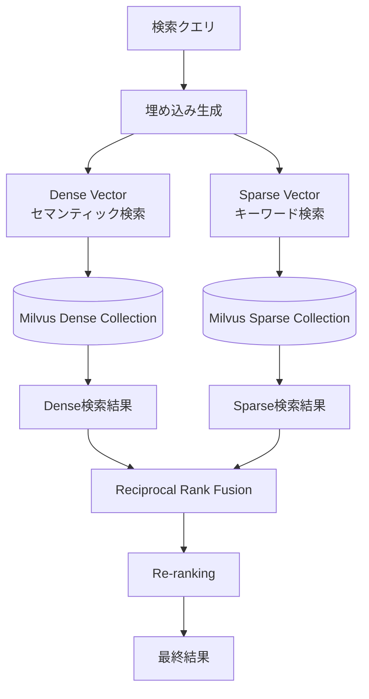

# Step03: ベクター検索エンジンの仕組み

## 🎯 この章の目標
BGE-M3を活用したハイブリッド検索エンジンの内部実装、RRF（Reciprocal Rank Fusion）アルゴリズム、ベクター検索の最適化手法を理解する

---

## 📋 概要

ハイブリッド検索エンジンは、このRAGシステムの心臓部として、Dense Vector検索（セマンティック検索）とSparse Vector検索（キーワード検索）を組み合わせ、高精度な検索結果を提供します。

### 🏗️ 検索エンジンの構造

```
app/services/hybrid_search_engine.py
├── SearchMode (検索モード定義)
├── RankingAlgorithm (ランキングアルゴリズム)
├── SearchConfig (検索設定)
├── SearchQuery (検索クエリ)
├── SearchResult (検索結果)
└── HybridSearchEngine (メインエンジン)
```

---

## 🔍 検索モードの詳細

### 1. ハイブリッド検索 (HYBRID)

Dense VectorとSparse Vectorの両方を使用し、RRFで結果を統合します。



#### 実装コード例:
```python
async def hybrid_search(
    self, 
    query: SearchQuery
) -> SearchResult:
    """ハイブリッド検索の実行"""
    start_time = time.time()
    
    # 1. クエリベクターの生成
    query_embedding = await self._generate_query_embedding(query.text)
    
    # 2. 並行してDenseとSparse検索を実行
    dense_future = self._search_dense_vectors(
        query_embedding["dense"], 
        query.filters,
        self.config.top_k * 2  # RRF用に多めに取得
    )
    sparse_future = self._search_sparse_vectors(
        query_embedding["sparse"],
        query.filters, 
        self.config.top_k * 2
    )
    
    dense_results, sparse_results = await asyncio.gather(
        dense_future, sparse_future
    )
    
    # 3. RRFで結果統合
    fused_results = self._reciprocal_rank_fusion(
        dense_results, sparse_results,
        self.config.dense_weight, self.config.sparse_weight
    )
    
    # 4. 最終フィルタリングとスコア調整
    final_results = self._apply_final_ranking(
        fused_results, query
    )[:self.config.top_k]
    
    return SearchResult(
        query=query.text,
        documents=final_results,
        total_hits=len(fused_results),
        search_time=(time.time() - start_time),
        success=True
    )
```

### 2. セマンティック検索 (SEMANTIC)

Dense Vectorのみを使用した意味的類似性に基づく検索です。

```python
async def semantic_search(
    self, 
    query: SearchQuery
) -> SearchResult:
    """セマンティック検索（Dense重視）"""
    # Dense weight = 1.0, Sparse weight = 0.0で実行
    temp_config = self.config.copy()
    temp_config.dense_weight = 1.0
    temp_config.sparse_weight = 0.0
    
    query_embedding = await self._generate_query_embedding(query.text)
    
    results = await self._search_dense_vectors(
        query_embedding["dense"],
        query.filters,
        self.config.top_k
    )
    
    return SearchResult(
        query=query.text,
        documents=results,
        total_hits=len(results),
        search_time=time.time() - start_time,
        success=True
    )
```

### 3. キーワード検索 (KEYWORD)

Sparse Vectorのみを使用した従来型のキーワードマッチング検索です。

```python
async def keyword_search(
    self, 
    query: SearchQuery
) -> SearchResult:
    """キーワード検索（Sparse重視）"""
    # Dense weight = 0.0, Sparse weight = 1.0で実行
    temp_config = self.config.copy()
    temp_config.dense_weight = 0.0
    temp_config.sparse_weight = 1.0
    
    query_embedding = await self._generate_query_embedding(query.text)
    
    results = await self._search_sparse_vectors(
        query_embedding["sparse"],
        query.filters,
        self.config.top_k
    )
    
    return SearchResult(
        query=query.text,
        documents=results,
        total_hits=len(results),
        search_time=time.time() - start_time,
        success=True
    )
```

---

## 🔄 RRF (Reciprocal Rank Fusion) アルゴリズム

### RRFの基本概念

RRFは複数の検索結果を統合するためのアルゴリズムで、各結果リストでのランク位置を基にスコアを計算します。

#### 数式:
```
RRF_Score(d) = Σ(weight_i / (k + rank_i(d)))
```

- `d`: ドキュメント
- `weight_i`: 検索手法iの重み
- `k`: 定数（通常60）
- `rank_i(d)`: 検索手法iでのドキュメントdのランク

### 実装詳細

```python
def _reciprocal_rank_fusion(
    self,
    dense_results: list[dict],
    sparse_results: list[dict], 
    dense_weight: float = 0.7,
    sparse_weight: float = 0.3,
    k: int = 60
) -> list[dict]:
    """RRFによる結果統合"""
    
    # ドキュメントIDでグループ化
    document_scores: dict[str, dict] = {}
    
    # Dense結果のスコア計算
    for rank, doc in enumerate(dense_results, 1):
        doc_id = doc["id"]
        rrf_score = dense_weight / (k + rank)
        
        if doc_id not in document_scores:
            document_scores[doc_id] = {
                "document": doc,
                "rrf_score": 0.0,
                "dense_rank": rank,
                "sparse_rank": None,
                "dense_score": doc.get("score", 0.0),
                "sparse_score": 0.0
            }
        
        document_scores[doc_id]["rrf_score"] += rrf_score
        document_scores[doc_id]["dense_rank"] = rank
        document_scores[doc_id]["dense_score"] = doc.get("score", 0.0)
    
    # Sparse結果のスコア計算
    for rank, doc in enumerate(sparse_results, 1):
        doc_id = doc["id"]
        rrf_score = sparse_weight / (k + rank)
        
        if doc_id not in document_scores:
            document_scores[doc_id] = {
                "document": doc,
                "rrf_score": 0.0,
                "dense_rank": None,
                "sparse_rank": rank,
                "dense_score": 0.0,
                "sparse_score": doc.get("score", 0.0)
            }
        
        document_scores[doc_id]["rrf_score"] += rrf_score
        document_scores[doc_id]["sparse_rank"] = rank
        document_scores[doc_id]["sparse_score"] = doc.get("score", 0.0)
    
    # RRFスコアでソート
    sorted_docs = sorted(
        document_scores.values(),
        key=lambda x: x["rrf_score"],
        reverse=True
    )
    
    # 詳細な説明を付加
    final_results = []
    for item in sorted_docs:
        doc = item["document"].copy()
        doc["search_score"] = item["rrf_score"]
        doc["ranking_explanation"] = {
            "rrf_score": item["rrf_score"],
            "dense_rank": item["dense_rank"],
            "sparse_rank": item["sparse_rank"],
            "dense_score": item["dense_score"],
            "sparse_score": item["sparse_score"],
            "fusion_method": "reciprocal_rank_fusion"
        }
        final_results.append(doc)
    
    return final_results
```

### RRFの特徴と利点

#### ✅ 利点
1. **ランク位置重視**: 個別スコアの絶対値に依存せず、相対的な順位を重視
2. **重み調整可能**: Dense/Sparse検索の重要度を柔軟に調整
3. **異なるスケール対応**: 異なる検索手法のスコア範囲の違いを吸収

#### ⚠️ 注意点
1. **上位偏重**: 低ランクの結果は大幅にスコアが下がる
2. **パラメータ調整**: kの値とweightの調整が結果品質に大きく影響

---

## 🎛️ フィルタリングとファセット

### フィルター実装

```python
class SearchFilter:
    """検索フィルター"""
    
    def __init__(self, field: str, value: Any, operator: str = "eq"):
        self.field = field
        self.value = value
        self.operator = operator
    
    def to_milvus_expr(self) -> str:
        """MilvusのフィルタリングExpressionに変換"""
        if self.operator == "eq":
            if isinstance(self.value, str):
                return f'{self.field} == "{self.value}"'
            else:
                return f'{self.field} == {self.value}'
        
        elif self.operator == "in":
            if isinstance(self.value, list):
                if all(isinstance(v, str) for v in self.value):
                    values = ', '.join(f'"{v}"' for v in self.value)
                    return f'{self.field} in [{values}]'
                else:
                    values = ', '.join(str(v) for v in self.value)
                    return f'{self.field} in [{values}]'
        
        elif self.operator == "gte":
            return f'{self.field} >= {self.value}'
        
        elif self.operator == "lte":
            return f'{self.field} <= {self.value}'
        
        # その他の演算子...
        raise ValueError(f"Unsupported operator: {self.operator}")

async def _apply_filters(
    self, 
    filters: list[SearchFilter]
) -> str:
    """フィルターをMilvus式に変換"""
    if not filters:
        return ""
    
    expressions = []
    for filter_obj in filters:
        expr = filter_obj.to_milvus_expr()
        expressions.append(expr)
    
    # AND条件で結合
    return " && ".join(expressions)
```

### ファセット機能

```python
async def _generate_facets(
    self, 
    search_results: list[dict], 
    facet_fields: list[str]
) -> dict[str, list[FacetValue]]:
    """検索結果からファセットを生成"""
    facets = {}
    
    for field in facet_fields:
        field_values = defaultdict(int)
        
        for doc in search_results:
            # ドキュメントからフィールド値を抽出
            value = self._extract_field_value(doc, field)
            if value is not None:
                if isinstance(value, list):
                    for v in value:
                        field_values[str(v)] += 1
                else:
                    field_values[str(value)] += 1
        
        # 頻度順でソート
        sorted_values = sorted(
            field_values.items(),
            key=lambda x: x[1],
            reverse=True
        )
        
        facets[field] = [
            FacetValue(value=value, count=count)
            for value, count in sorted_values[:10]  # 上位10件
        ]
    
    return facets

def _extract_field_value(self, document: dict, field: str) -> Any:
    """ドキュメントからフィールド値を抽出"""
    # ネストしたフィールドにも対応
    # 例: "metadata.tags" -> document["metadata"]["tags"]
    
    parts = field.split(".")
    value = document
    
    for part in parts:
        if isinstance(value, dict) and part in value:
            value = value[part]
        else:
            return None
    
    return value
```

---

## ⚡ パフォーマンス最適化

### 1. 並行検索実行

```python
async def _execute_parallel_search(
    self, 
    query: SearchQuery
) -> tuple[list[dict], list[dict]]:
    """Dense検索とSparse検索を並行実行"""
    
    # セマフォで同時実行数を制限
    async with self._search_semaphore:
        dense_task = asyncio.create_task(
            self._search_dense_vectors(query)
        )
        sparse_task = asyncio.create_task(
            self._search_sparse_vectors(query)
        )
        
        # タイムアウト付きで実行
        try:
            dense_results, sparse_results = await asyncio.wait_for(
                asyncio.gather(dense_task, sparse_task),
                timeout=self.config.search_timeout
            )
            return dense_results, sparse_results
            
        except asyncio.TimeoutError:
            logger.warning(f"Search timeout after {self.config.search_timeout}s")
            # 部分結果でも返す
            dense_results = dense_task.result() if dense_task.done() else []
            sparse_results = sparse_task.result() if sparse_task.done() else []
            return dense_results, sparse_results
```

### 2. 結果キャッシング

```python
from functools import lru_cache
import hashlib

class CachedSearchEngine(HybridSearchEngine):
    def __init__(self, *args, **kwargs):
        super().__init__(*args, **kwargs)
        self._cache = {}
        self._cache_ttl = 300  # 5分
    
    def _generate_cache_key(self, query: SearchQuery) -> str:
        """クエリからキャッシュキーを生成"""
        query_data = {
            "text": query.text,
            "filters": [f.to_dict() for f in query.filters],
            "top_k": query.max_results,
            "search_mode": self.config.search_mode.value
        }
        query_str = json.dumps(query_data, sort_keys=True)
        return hashlib.md5(query_str.encode()).hexdigest()
    
    async def search(self, query: SearchQuery) -> SearchResult:
        """キャッシュ機能付き検索"""
        cache_key = self._generate_cache_key(query)
        
        # キャッシュから取得を試行
        cached_result = self._get_from_cache(cache_key)
        if cached_result:
            logger.debug(f"Cache hit for query: {query.text}")
            return cached_result
        
        # キャッシュミスの場合は実際に検索
        result = await super().search(query)
        
        # 成功した場合はキャッシュに保存
        if result.success:
            self._save_to_cache(cache_key, result)
        
        return result
```

### 3. インデックス最適化

```python
# Milvusインデックス設定の最適化
DENSE_INDEX_PARAMS = {
    "index_type": "HNSW",
    "metric_type": "IP",  # Inner Product
    "params": {
        "M": 16,              # グラフの最大接続数
        "efConstruction": 256  # インデックス構築時の探索幅
    }
}

SPARSE_INDEX_PARAMS = {
    "index_type": "SPARSE_INVERTED_INDEX",
    "metric_type": "IP",
    "params": {
        "drop_ratio_build": 0.2  # 低頻度語の除外率
    }
}

# 検索時パラメータ
SEARCH_PARAMS = {
    "dense": {
        "metric_type": "IP",
        "params": {
            "ef": 128,  # 検索時の探索幅
            "nprobe": 16  # 探索するクラスター数
        }
    },
    "sparse": {
        "params": {
            "drop_ratio_search": 0.2  # 検索時の低頻度語除外率
        }
    }
}
```

---

## ❗ よくある落とし穴と対策

### 1. ベクター次元不一致

```python
# ❌ 問題: 異なるモデルでの次元数不一致
def validate_vector_dimensions(self, vectors: list[float]) -> None:
    """ベクター次元数の検証"""
    expected_dim = 1024  # BGE-M3の次元数
    
    if len(vectors) != expected_dim:
        raise ValueError(
            f"Vector dimension mismatch: expected {expected_dim}, "
            f"got {len(vectors)}"
        )

# ✅ 対策: 事前検証と自動修正
async def _normalize_query_vector(
    self, 
    query_vector: list[float]
) -> list[float]:
    """クエリベクターの正規化"""
    # 次元数チェック
    self.validate_vector_dimensions(query_vector)
    
    # L2正規化
    vector_array = np.array(query_vector)
    normalized = vector_array / np.linalg.norm(vector_array)
    
    return normalized.tolist()
```

### 2. スコア正規化の問題

```python
# ❌ 問題: 異なる検索手法のスコア範囲が統一されていない
def naive_score_fusion(dense_score: float, sparse_score: float) -> float:
    # Dense: 0.0-1.0, Sparse: 0.0-100.0 -> 不公平な結合
    return 0.7 * dense_score + 0.3 * sparse_score

# ✅ 対策: スコア正規化
def _normalize_scores(
    self, 
    results: list[dict], 
    score_field: str = "score"
) -> list[dict]:
    """スコアの正規化（0-1範囲）"""
    if not results:
        return results
    
    scores = [doc.get(score_field, 0.0) for doc in results]
    min_score = min(scores)
    max_score = max(scores)
    
    if max_score == min_score:
        # 全て同じスコアの場合
        for doc in results:
            doc[f"normalized_{score_field}"] = 1.0
    else:
        # Min-Max正規化
        for doc in results:
            original_score = doc.get(score_field, 0.0)
            normalized = (original_score - min_score) / (max_score - min_score)
            doc[f"normalized_{score_field}"] = normalized
    
    return results
```

### 3. メモリリークと接続管理

```python
# ✅ 適切なリソース管理
class HybridSearchEngine:
    def __init__(self, config: SearchConfig):
        self.config = config
        self._milvus_client = None
        self._connection_pool = None
        self._search_semaphore = asyncio.Semaphore(
            config.max_concurrent_searches
        )
    
    async def __aenter__(self):
        """非同期コンテキストマネージャー"""
        await self.initialize()
        return self
    
    async def __aexit__(self, exc_type, exc_val, exc_tb):
        """リソース解放"""
        await self.cleanup()
    
    async def cleanup(self):
        """リソースの適切な解放"""
        if self._milvus_client:
            await self._milvus_client.close()
        if self._connection_pool:
            await self._connection_pool.close()
```

---

## 🎯 理解確認のための設問

### 基本理解
1. ハイブリッド検索でDense VectorとSparse Vectorを組み合わせる理由を説明してください
2. RRF（Reciprocal Rank Fusion）の計算式と、なぜランク位置を重視するのかを説明してください
3. セマンティック検索とキーワード検索の違いと、それぞれが適している用途を説明してください

### アルゴリズム理解
1. RRFでk=60という定数が使用される理由と、この値を変更することの影響を説明してください
2. `dense_weight=0.7, sparse_weight=0.3`というデフォルト設定の根拠を考察してください
3. ファセット生成時に上位10件のみを返却する理由と、この制限の意義を説明してください

### 実装理解
1. 並行検索実行でタイムアウト処理が重要な理由を説明してください
2. 検索結果のキャッシュキー生成で考慮すべき要素を5つ挙げてください
3. Milvusインデックスパラメータ（M、efConstruction）の調整が検索性能に与える影響を説明してください

### パフォーマンス理解
1. 検索性能のボトルネックになりやすい3つの要因と対策を説明してください
2. ベクター次元数の不一致が検索精度に与える影響と検証方法を説明してください
3. スコア正規化を行わない場合の問題点と、Min-Max正規化の利点を説明してください

---

## 📚 次のステップ

ベクター検索エンジンの仕組みを理解できたら、次の学習段階に進んでください：

- **Step04**: 埋め込みサービスとBGE-M3 - ベクター生成の詳細プロセス
- **Step05**: データモデル設計 - PostgreSQL・Milvusのスキーマ詳細
- **Step06**: 認証・認可システム - JWT・API Key認証の実装
- **Step07**: エラーハンドリングと監視 - 例外処理・ログ・メトリクス

ベクター検索エンジンは、システムの核心技術です。次のステップでは、このエンジンが使用するベクターの生成プロセスについて詳しく学習します。