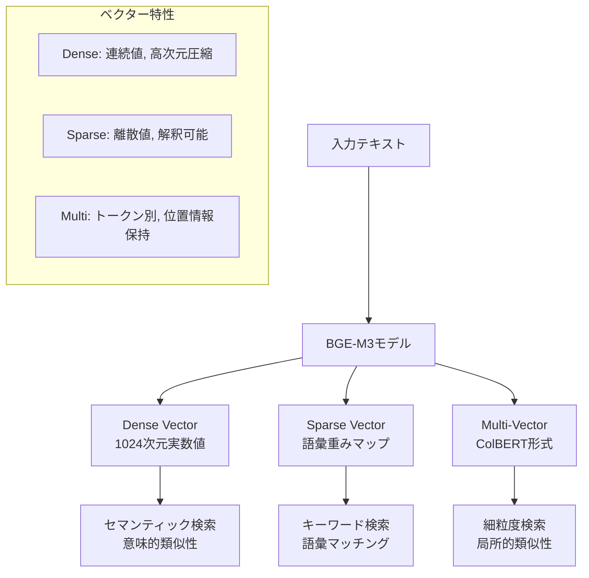

# Step04: 埋め込みサービスとBGE-M3

## 🎯 この章の目標
BGE-M3モデルを使用した埋め込みサービスの内部実装、3種類のベクター生成プロセス、パフォーマンス最適化手法を理解する

---

## 📋 概要

埋め込みサービス（Embedding Service）は、テキストを数値ベクターに変換する重要なコンポーネントです。BGE-M3（BAAI General Embedding Model M3）を使用して、Dense Vector、Sparse Vector、Multi-Vectorの3種類を同時生成し、高精度なハイブリッド検索を実現します。

### 🏗️ 埋め込みサービスの構造

```
app/services/embedding_service.py
├── EmbeddingConfig (設定クラス)
├── EmbeddingResult (結果クラス)
├── BatchEmbeddingRequest (バッチリクエスト)
├── EmbeddingService (メインサービス)
└── BGE-M3モデル統合ロジック
```

---

## 🧠 BGE-M3モデルの詳細

### BGE-M3の特徴

BGE-M3（Multi-Functionality, Multi-Granularity, Multi-Linguality）は、以下の特徴を持つ最新の埋め込みモデルです：

1. **Multi-Functionality**: Dense、Sparse、Multi-Vector を同時生成
2. **Multi-Granularity**: 単語、文、パラグラフレベルでの表現
3. **Multi-Linguality**: 100以上の言語をサポート

### 3種類のベクター



#### 1. Dense Vector（密ベクター）
- **次元**: 1024次元の実数値ベクター
- **特徴**: 連続空間での意味表現、高次元圧縮
- **用途**: セマンティック検索、意味的類似性の測定

```python
# Dense Vectorの例
dense_vector = [0.1234, -0.5678, 0.9012, ..., 0.3456]  # 1024次元
```

#### 2. Sparse Vector（疎ベクター）
- **形式**: 語彙ID → 重みのマッピング
- **特徴**: 解釈可能性が高い、従来のTF-IDFに近い
- **用途**: キーワード検索、完全一致重視の検索

```python
# Sparse Vectorの例
sparse_vector = {
    1234: 0.8,    # "認証" のID: 重み
    5678: 0.6,    # "システム" のID: 重み
    9012: 0.4,    # "実装" のID: 重み
    3456: 0.2     # "方法" のID: 重み
}
```

#### 3. Multi-Vector（ColBERT形式）
- **形式**: トークンごとの1024次元ベクター配列
- **特徴**: 位置情報保持、局所的特徴抽出
- **用途**: 細粒度検索、部分マッチング

```python
# Multi-Vectorの例
multi_vector = [
    [0.1, -0.2, 0.3, ..., 0.4],  # トークン1のベクター
    [0.5, -0.6, 0.7, ..., 0.8],  # トークン2のベクター
    [0.9, -0.1, 0.2, ..., 0.3],  # トークン3のベクター
    # ... 各トークンに対応
]
```

---

## 🔧 埋め込みサービスの実装

### 設定クラス

```python
class EmbeddingConfig(BaseModel):
    """埋め込みサービスの設定"""
    
    model_name: str = Field(
        default="BAAI/BGE-M3", 
        description="BGE-M3モデル名"
    )
    device: str = Field(
        default="auto", 
        description="実行デバイス (auto, cpu, cuda)"
    )
    batch_size: int = Field(
        default=16, 
        description="バッチサイズ"
    )
    max_length: int = Field(
        default=8192, 
        description="最大トークン長"
    )
    use_fp16: bool = Field(
        default=True, 
        description="FP16使用フラグ"
    )
    normalize_embeddings: bool = Field(
        default=True, 
        description="ベクトル正規化フラグ"
    )
```

### メインサービスクラス

```python
class EmbeddingService:
    """BGE-M3 埋め込みサービス"""
    
    def __init__(self, config: EmbeddingConfig):
        self.config = config
        self.model = None
        self.device = _detect_device(config.device)
        self._is_initialized = False
        self._model_lock = asyncio.Lock()
    
    async def initialize(self) -> None:
        """モデルの初期化"""
        if self._is_initialized:
            return
        
        async with self._model_lock:
            if self._is_initialized:
                return
            
            try:
                logger.info(f"Loading BGE-M3 model: {self.config.model_name}")
                
                # BGE-M3モデルの読み込み
                self.model = FlagModel(
                    self.config.model_name,
                    query_instruction_for_retrieval="クエリ: ",
                    passage_instruction_for_retrieval="パッセージ: ",
                    use_fp16=self.config.use_fp16
                )
                
                # デバイスの設定
                if hasattr(self.model, 'to'):
                    self.model.to(self.device)
                
                self._is_initialized = True
                logger.info(f"BGE-M3 model loaded successfully on {self.device}")
                
            except Exception as e:
                logger.error(f"Failed to initialize BGE-M3 model: {e}")
                raise RuntimeError(f"Model initialization failed: {e}")
    
    async def embed_text(
        self, 
        text: str, 
        text_type: str = "passage"
    ) -> EmbeddingResult:
        """単一テキストの埋め込み生成"""
        
        if not self._is_initialized:
            await self.initialize()
        
        start_time = time.time()
        
        try:
            # BGE-M3で3種類のベクターを同時生成
            embeddings = await self._generate_embeddings([text], text_type)
            
            processing_time = time.time() - start_time
            
            return EmbeddingResult(
                dense_vector=embeddings["dense_vecs"][0].tolist(),
                sparse_vector=embeddings["lexical_weights"][0],
                multi_vector=embeddings["colbert_vecs"][0],
                processing_time=processing_time
            )
            
        except Exception as e:
            logger.error(f"Text embedding failed: {e}")
            raise RuntimeError(f"Embedding generation failed: {e}")
    
    async def embed_batch(
        self, 
        texts: list[str], 
        text_type: str = "passage"
    ) -> list[EmbeddingResult]:
        """バッチテキストの埋め込み生成"""
        
        if not texts:
            return []
        
        if not self._is_initialized:
            await self.initialize()
        
        start_time = time.time()
        results = []
        
        try:
            # バッチサイズごとに分割処理
            for i in range(0, len(texts), self.config.batch_size):
                batch_texts = texts[i:i + self.config.batch_size]
                
                # バッチ埋め込み生成
                embeddings = await self._generate_embeddings(batch_texts, text_type)
                
                # 結果を個別のEmbeddingResultに変換
                for j, text in enumerate(batch_texts):
                    result = EmbeddingResult(
                        dense_vector=embeddings["dense_vecs"][j].tolist(),
                        sparse_vector=embeddings["lexical_weights"][j],
                        multi_vector=embeddings["colbert_vecs"][j],
                        processing_time=0.0  # バッチ処理時は個別時間なし
                    )
                    results.append(result)
            
            total_time = time.time() - start_time
            logger.info(
                f"Batch embedding completed: {len(texts)} texts in {total_time:.2f}s"
            )
            
            return results
            
        except Exception as e:
            logger.error(f"Batch embedding failed: {e}")
            raise RuntimeError(f"Batch embedding generation failed: {e}")
    
    async def _generate_embeddings(
        self, 
        texts: list[str], 
        text_type: str = "passage"
    ) -> dict[str, Any]:
        """BGE-M3での埋め込み生成"""
        
        try:
            # 非同期実行をブロッキング実行に変換
            loop = asyncio.get_event_loop()
            embeddings = await loop.run_in_executor(
                None, 
                self._sync_generate_embeddings, 
                texts, 
                text_type
            )
            
            return embeddings
            
        except Exception as e:
            logger.error(f"BGE-M3 embedding generation failed: {e}")
            raise
    
    def _sync_generate_embeddings(
        self, 
        texts: list[str], 
        text_type: str = "passage"
    ) -> dict[str, Any]:
        """同期的な埋め込み生成"""
        
        # BGE-M3モデルでの埋め込み生成
        embeddings = self.model.encode(
            texts,
            batch_size=min(len(texts), self.config.batch_size),
            max_length=self.config.max_length,
            return_dense=True,
            return_sparse=True, 
            return_colbert_vecs=True
        )
        
        # 正規化処理
        if self.config.normalize_embeddings:
            embeddings = self._normalize_embeddings(embeddings)
        
        return embeddings
    
    def _normalize_embeddings(
        self, 
        embeddings: dict[str, Any]
    ) -> dict[str, Any]:
        """埋め込みベクターの正規化"""
        
        # Dense vectorのL2正規化
        if "dense_vecs" in embeddings:
            dense_vecs = embeddings["dense_vecs"]
            norms = np.linalg.norm(dense_vecs, axis=1, keepdims=True)
            embeddings["dense_vecs"] = dense_vecs / (norms + 1e-12)
        
        # Sparse vectorの正規化（オプション）
        if "lexical_weights" in embeddings:
            for i, sparse_dict in enumerate(embeddings["lexical_weights"]):
                if sparse_dict:
                    # L1正規化
                    total_weight = sum(sparse_dict.values())
                    if total_weight > 0:
                        embeddings["lexical_weights"][i] = {
                            k: v / total_weight 
                            for k, v in sparse_dict.items()
                        }
        
        return embeddings
```

---

## ⚡ パフォーマンス最適化

### 1. デバイス自動選択

```python
def _detect_device(preferred_device: str) -> str:
    """最適なデバイスを検出"""
    if preferred_device == "auto":
        if HAS_EMBEDDING_LIBS and torch_module and torch_module.cuda.is_available():
            gpu_memory = torch_module.cuda.get_device_properties(0).total_memory
            logger.info(f"CUDA available with {gpu_memory // (1024**3)}GB memory")
            return "cuda"
        else:
            logger.info("Using CPU for embedding generation")
            return "cpu"
    return preferred_device
```

### 2. バッチ処理最適化

```python
async def embed_documents_optimized(
    self, 
    documents: list[dict], 
    chunk_key: str = "content"
) -> list[dict]:
    """ドキュメントの最適化埋め込み処理"""
    
    # テキスト抽出とバッチング
    texts = [doc.get(chunk_key, "") for doc in documents]
    
    # 空テキストのフィルタリング
    non_empty_indices = [
        i for i, text in enumerate(texts) 
        if text and text.strip()
    ]
    non_empty_texts = [texts[i] for i in non_empty_indices]
    
    if not non_empty_texts:
        return documents  # 埋め込み対象なし
    
    # 最適バッチサイズの計算
    optimal_batch_size = self._calculate_optimal_batch_size(non_empty_texts)
    
    # バッチ処理
    all_embeddings = []
    for i in range(0, len(non_empty_texts), optimal_batch_size):
        batch_texts = non_empty_texts[i:i + optimal_batch_size]
        batch_embeddings = await self.embed_batch(batch_texts)
        all_embeddings.extend(batch_embeddings)
    
    # 結果をドキュメントに統合
    embedding_idx = 0
    for doc_idx in non_empty_indices:
        if embedding_idx < len(all_embeddings):
            documents[doc_idx]["embeddings"] = all_embeddings[embedding_idx]
            embedding_idx += 1
    
    return documents

def _calculate_optimal_batch_size(self, texts: list[str]) -> int:
    """最適なバッチサイズを計算"""
    if self.device == "cuda":
        # GPU使用時：メモリ使用量を考慮
        avg_length = sum(len(text) for text in texts) / len(texts)
        
        if avg_length < 512:
            return min(32, self.config.batch_size)
        elif avg_length < 2048:
            return min(16, self.config.batch_size)
        else:
            return min(8, self.config.batch_size)
    else:
        # CPU使用時：処理能力を考慮
        return min(8, self.config.batch_size)
```

### 3. キャッシング機能

```python
class CachedEmbeddingService(EmbeddingService):
    """キャッシュ機能付き埋め込みサービス"""
    
    def __init__(self, config: EmbeddingConfig, redis_client=None):
        super().__init__(config)
        self.redis_client = redis_client
        self.cache_ttl = 3600 * 24  # 24時間
    
    async def embed_text_cached(
        self, 
        text: str, 
        text_type: str = "passage"
    ) -> EmbeddingResult:
        """キャッシュ機能付きテキスト埋め込み"""
        
        # キャッシュキーの生成
        cache_key = self._generate_cache_key(text, text_type)
        
        # キャッシュから取得を試行
        if self.redis_client:
            cached_result = await self._get_from_cache(cache_key)
            if cached_result:
                logger.debug(f"Cache hit for text embedding")
                return cached_result
        
        # キャッシュミスの場合は実際に埋め込み生成
        result = await self.embed_text(text, text_type)
        
        # 成功した場合はキャッシュに保存
        if self.redis_client and result:
            await self._save_to_cache(cache_key, result)
        
        return result
    
    def _generate_cache_key(self, text: str, text_type: str) -> str:
        """キャッシュキーの生成"""
        content = f"{text_type}:{text}:{self.config.model_name}"
        return f"embedding:{hashlib.md5(content.encode()).hexdigest()}"
    
    async def _get_from_cache(self, cache_key: str) -> EmbeddingResult | None:
        """キャッシュからの取得"""
        try:
            cached_data = await self.redis_client.get(cache_key)
            if cached_data:
                data = json.loads(cached_data)
                return EmbeddingResult(**data)
        except Exception as e:
            logger.warning(f"Cache retrieval failed: {e}")
        return None
    
    async def _save_to_cache(
        self, 
        cache_key: str, 
        result: EmbeddingResult
    ) -> None:
        """キャッシュへの保存"""
        try:
            # Multi-vectorは容量が大きいため除外
            cache_data = {
                "dense_vector": result.dense_vector,
                "sparse_vector": result.sparse_vector,
                "processing_time": result.processing_time
            }
            await self.redis_client.setex(
                cache_key,
                self.cache_ttl,
                json.dumps(cache_data)
            )
        except Exception as e:
            logger.warning(f"Cache save failed: {e}")
```

---

## 🔍 ヘルスチェックと監視

### ヘルスチェック機能

```python
async def health_check(self) -> dict[str, Any]:
    """埋め込みサービスのヘルスチェック"""
    
    health_data = {
        "status": "unknown",
        "model_loaded": self._is_initialized,
        "device": self.device,
        "model_name": self.config.model_name,
        "timestamp": datetime.now().isoformat()
    }
    
    try:
        if not self._is_initialized:
            health_data["status"] = "not_initialized"
            return health_data
        
        # 簡単なテスト埋め込み生成
        test_text = "ヘルスチェックテスト"
        start_time = time.time()
        
        result = await self.embed_text(test_text)
        response_time = time.time() - start_time
        
        if result and len(result.dense_vector) == 1024:
            health_data.update({
                "status": "healthy",
                "test_embedding_time": response_time,
                "dense_vector_dim": len(result.dense_vector),
                "sparse_vector_size": len(result.sparse_vector)
            })
        else:
            health_data["status"] = "degraded"
            health_data["issue"] = "Invalid embedding result"
            
    except Exception as e:
        health_data.update({
            "status": "unhealthy",
            "error": str(e)
        })
    
    return health_data
```

### メトリクス収集

```python
class EmbeddingMetrics:
    """埋め込みサービスのメトリクス"""
    
    def __init__(self):
        self.total_requests = 0
        self.successful_requests = 0
        self.failed_requests = 0
        self.total_processing_time = 0.0
        self.batch_sizes = []
        self.error_types = defaultdict(int)
    
    def record_request(
        self, 
        success: bool, 
        processing_time: float,
        batch_size: int = 1,
        error_type: str = None
    ):
        """リクエストメトリクスの記録"""
        self.total_requests += 1
        
        if success:
            self.successful_requests += 1
            self.total_processing_time += processing_time
            self.batch_sizes.append(batch_size)
        else:
            self.failed_requests += 1
            if error_type:
                self.error_types[error_type] += 1
    
    def get_metrics(self) -> dict[str, Any]:
        """メトリクス情報の取得"""
        if self.total_requests == 0:
            return {"total_requests": 0}
        
        success_rate = self.successful_requests / self.total_requests
        avg_processing_time = (
            self.total_processing_time / self.successful_requests
            if self.successful_requests > 0 else 0
        )
        avg_batch_size = (
            sum(self.batch_sizes) / len(self.batch_sizes)
            if self.batch_sizes else 0
        )
        
        return {
            "total_requests": self.total_requests,
            "successful_requests": self.successful_requests,
            "failed_requests": self.failed_requests,
            "success_rate": success_rate,
            "average_processing_time_ms": avg_processing_time * 1000,
            "average_batch_size": avg_batch_size,
            "error_distribution": dict(self.error_types)
        }
```

---

## ❗ よくある落とし穴と対策

### 1. GPU メモリ不足

```python
# ❌ 問題: 大きなバッチサイズでGPUメモリ不足
async def embed_large_batch_naive(self, texts: list[str]) -> list[EmbeddingResult]:
    # 10000件のテキストを一度に処理 -> OOM Error
    return await self.embed_batch(texts)

# ✅ 対策: 動的バッチサイズ調整
async def embed_large_batch_safe(
    self, 
    texts: list[str]
) -> list[EmbeddingResult]:
    """安全な大規模バッチ処理"""
    results = []
    current_batch_size = self.config.batch_size
    
    for i in range(0, len(texts), current_batch_size):
        batch_texts = texts[i:i + current_batch_size]
        
        try:
            batch_results = await self.embed_batch(batch_texts)
            results.extend(batch_results)
            
        except RuntimeError as e:
            if "out of memory" in str(e).lower():
                # バッチサイズを半分に
                current_batch_size = max(1, current_batch_size // 2)
                logger.warning(f"Reduced batch size to {current_batch_size}")
                
                # GPU メモリをクリア
                if torch_module and torch_module.cuda.is_available():
                    torch_module.cuda.empty_cache()
                
                # リトライ
                batch_results = await self.embed_batch(batch_texts)
                results.extend(batch_results)
            else:
                raise
    
    return results
```

### 2. トークン長制限

```python
def _truncate_text_safely(self, text: str, max_length: int = 8192) -> str:
    """テキストの安全な切り詰め"""
    
    # 概算トークン数（日本語では1文字≈1.5トークン）
    estimated_tokens = len(text) * 1.5
    
    if estimated_tokens <= max_length:
        return text
    
    # 安全マージンを考慮して切り詰め
    safe_char_limit = int(max_length / 1.5 * 0.9)
    
    # 文の境界で切り詰め
    sentences = text.split('。')
    truncated = ""
    
    for sentence in sentences:
        if len(truncated + sentence + '。') <= safe_char_limit:
            truncated += sentence + '。'
        else:
            break
    
    return truncated if truncated else text[:safe_char_limit]
```

### 3. モデル初期化の競合

```python
# ✅ 適切な初期化管理
class EmbeddingService:
    def __init__(self, config: EmbeddingConfig):
        self.config = config
        self.model = None
        self._is_initialized = False
        self._initialization_lock = asyncio.Lock()
        self._initialization_task = None
    
    async def initialize(self) -> None:
        """スレッドセーフなモデル初期化"""
        if self._is_initialized:
            return
        
        # 既に初期化中の場合は待機
        if self._initialization_task:
            await self._initialization_task
            return
        
        async with self._initialization_lock:
            if self._is_initialized:
                return
            
            # 初期化タスクを作成
            self._initialization_task = asyncio.create_task(
                self._do_initialize()
            )
            
            try:
                await self._initialization_task
            finally:
                self._initialization_task = None
    
    async def _do_initialize(self) -> None:
        """実際の初期化処理"""
        # モデル読み込み処理...
        self._is_initialized = True
```

---

## 🎯 理解確認のための設問

### BGE-M3理解
1. BGE-M3が生成する3種類のベクター（Dense、Sparse、Multi-Vector）の特徴と適用場面を説明してください
2. Dense VectorとSparse Vectorの次元数の違いと、それが検索性能に与える影響を説明してください
3. Multi-Vector（ColBERT形式）が従来のDense Vectorよりも細かな検索を可能にする理由を説明してください

### 実装理解
1. 埋め込みサービスで非同期処理が重要な理由と、`run_in_executor`を使用する意図を説明してください
2. バッチ処理でバッチサイズを動的に調整する仕組みの利点を説明してください
3. ベクター正規化（L2正規化、L1正規化）を行う目的と効果を説明してください

### パフォーマンス理解
1. GPU使用時とCPU使用時でバッチサイズを変える理由を説明してください
2. 埋め込み結果のキャッシング戦略で考慮すべき要素を5つ挙げてください
3. テキスト長の制限を設ける理由と、安全な切り詰め方法の重要性を説明してください

### 運用理解
1. 埋め込みサービスのヘルスチェックで確認すべき項目を6つ挙げてください
2. GPU メモリ不足エラーが発生した際の対処手順を段階的に説明してください
3. モデル初期化で競合状態が発生する可能性とその対策を説明してください

---

## 📚 次のステップ

埋め込みサービスとBGE-M3を理解できたら、次の学習段階に進んでください：

- **Step05**: データモデル設計 - PostgreSQL・Milvusのスキーマ詳細
- **Step06**: 認証・認可システム - JWT・API Key認証の実装
- **Step07**: エラーハンドリングと監視 - 例外処理・ログ・メトリクス
- **Step08**: デプロイメントと運用 - Docker・Kubernetes・監視

埋め込みサービスは、RAGシステムの品質を決定する重要なコンポーネントです。次のステップでは、生成されたベクターがどのように保存・管理されるかを学習します。