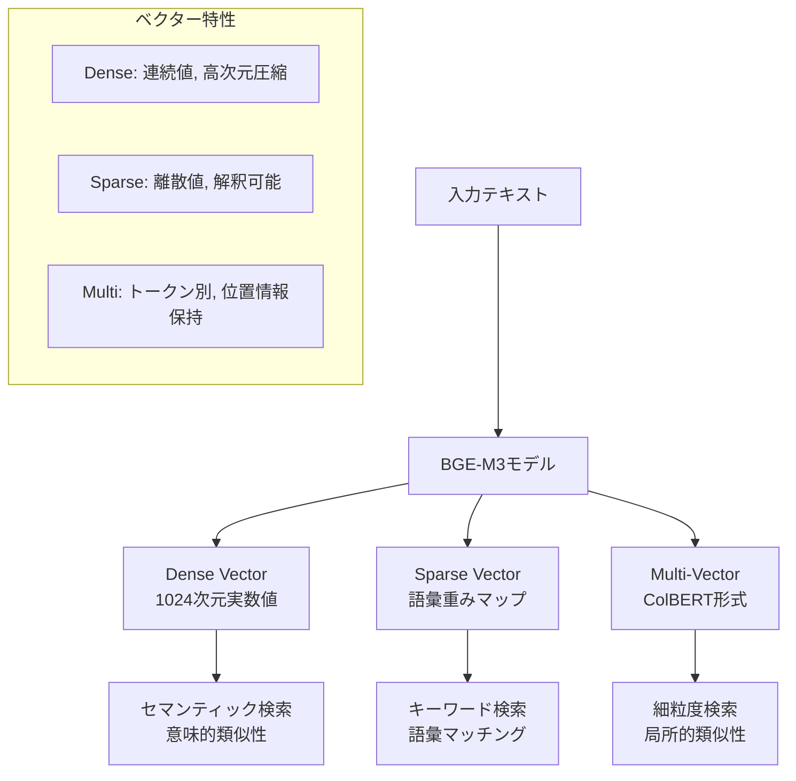

# Step04: 埋め込みサービスとBGE-M3

## 🎯 この章の目標

BGE-M3モデルを使用した埋め込みサービスの内部実装、3種類のベクター生成プロセス、パフォーマンス最適化手法を理解する

---

## 📋 概要

埋め込みサービス（Embedding Service）は、テキストを数値ベクターに変換する重要なコンポーネントです。
BGE-M3（BAAI General Embedding Model M3）を使用して、Dense Vector、Sparse Vector、Multi-Vectorの3種類を同時生成し、
高精度なハイブリッド検索を実現します。

### 🏗️ 埋め込みサービスの構造

```text
app/services/embedding_service.py
├── EmbeddingConfig (設定クラス)
├── EmbeddingResult (結果クラス)
├── BatchEmbeddingRequest (バッチリクエスト)
├── EmbeddingService (メインサービス)
└── BGE-M3モデル統合ロジック
```

---

## 🧠 BGE-M3モデルの詳細

### BGE-M3の特徴

BGE-M3（Multi-Functionality, Multi-Granularity, Multi-Linguality）は、以下の特徴を持つ最新の埋め込みモデルです：

1. **Multi-Functionality**: Dense、Sparse、Multi-Vector を同時生成
2. **Multi-Granularity**: 単語、文、パラグラフレベルでの表現
3. **Multi-Linguality**: 100以上の言語をサポート

### 3種類のベクター



#### 1. Dense Vector（密ベクター）

- **次元**: 1024次元の実数値ベクター
- **特徴**: 連続空間での意味表現、高次元圧縮
- **用途**: セマンティック検索、意味的類似性の測定

```python
# Dense Vectorの例
dense_vector = [0.1234, -0.5678, 0.9012, ..., 0.3456]  # 1024次元
```

#### 2. Sparse Vector（疎ベクター）

- **形式**: 語彙ID → 重みのマッピング
- **特徴**: 解釈可能性が高い、従来のTF-IDFに近い
- **用途**: キーワード検索、完全一致重視の検索

```python
# Sparse Vectorの例
sparse_vector = {
    1234: 0.8,    # "認証" のID: 重み
    5678: 0.6,    # "システム" のID: 重み
    9012: 0.4,    # "実装" のID: 重み
    3456: 0.2     # "方法" のID: 重み
}
```

#### 3. Multi-Vector（ColBERT形式）

- **形式**: トークンごとの1024次元ベクター配列
- **特徴**: 位置情報保持、局所的特徴抽出
- **用途**: 細粒度検索、部分マッチング

```python
# Multi-Vectorの例
multi_vector = [
    [0.1, -0.2, 0.3, ..., 0.4],  # トークン1のベクター
    [0.5, -0.6, 0.7, ..., 0.8],  # トークン2のベクター
    [0.9, -0.1, 0.2, ..., 0.3],  # トークン3のベクター
    # ... 各トークンに対応
]
```

---

## 🔧 埋め込みサービスの実装

### 設定クラス

**実装ファイル**: `../../app/services/embedding_service.py` (EmbeddingConfigクラス)

埋め込みサービスの設定は、柔軟性と拡張性を重視した設計となっています。

**設定パラメータの詳細**:

1. **model_name** (デフォルト: "BAAI/BGE-M3"):
   - 使用するBGE-M3モデルのHugging Face上の名前
   - 他のバージョンへの切り替えも可能
   - カスタムモデルパスにも対応

2. **device** (デフォルト: "auto"):
   - "auto": 自動的に最適なデバイスを選択
   - "cuda": GPU強制使用
   - "cpu": CPU強制使用
   - マルチGPU環境では自動的に最適なGPUを選択

3. **batch_size** (デフォルト: 16):
   - 一度に処理するテキストの数
   - メモリ容量に応じて調整可能
   - GPUメモリ不足時は自動的に縮小

4. **max_length** (デフォルト: 8192):
   - BGE-M3の最大トークン長
   - 長文ドキュメントの処理に対応
   - 超過時は自動的に切り詰め処理

5. **use_fp16** (デフォルト: True):
   - 半精度浮動小数点の使用
   - メモリ使用量を半減、処理速度向上
   - 精度への影響は最小限

6. **normalize_embeddings** (デフォルト: True):
   - ベクトルのL2正規化
   - コサイン類似度計算の高速化
   - 検索精度の安定化に寄与

### メインサービスクラス

**実装ファイル**: `../../app/services/embedding_service.py` (EmbeddingServiceクラス)

BGE-M3埋め込みサービスの中核となるクラスで、効率的なベクトル生成を実現します。

**主要な機能と設計思想**:

1. **非同期初期化**:
   - モデルの遅延読み込みによるメモリ効率化
   - ダブルチェックロッキングパターンで競合状態を防止
   - 初期化エラー時の詳細なエラーハンドリング

2. **デバイス管理**:
   - 自動デバイス検出機能（GPU/CPU）
   - GPU利用可能時は自動的にGPUを選択
   - デバイス固有の最適化を自動適用

3. **BGE-M3モデルの設定**:
   - 日本語用のインストラクション（"クエリ: "、"パッセージ: "）
   - FP16モードによる高速化とメモリ効率化
   - モデルパラメータの動的調整

**埋め込み生成プロセス**:

1. **単一テキスト処理** (`embed_text`):
   - 1つのテキストから3種類のベクトルを生成
   - 処理時間の計測と記録
   - エラー時の詳細なコンテキスト情報

2. **バッチ処理** (`embed_batch`):
   - 大量テキストの効率的な処理
   - 設定されたバッチサイズで自動分割
   - メモリ使用量とスループットの最適化

3. **非同期・同期変換**:
   - CPU集約的な処理をスレッドプールで実行
   - メインイベントループのブロッキング防止
   - 並行リクエストの効率的な処理

**ベクトル正規化**:

1. **Dense Vector**:
   - L2正規化による単位ベクトル化
   - コサイン類似度計算の高速化
   - 数値安定性のための微小値追加（1e-12）

2. **Sparse Vector**:
   - L1正規化による重み分布の標準化
   - ゼロ除算の防止
   - 語彙重要度の相対的な保持

**エラーハンドリング**:
- 初期化失敗時の明確なエラーメッセージ
- 処理中のエラーを適切にラップして伝播
- ログによる詳細なデバッグ情報の記録

---

## ⚡ パフォーマンス最適化

### 1. デバイス自動選択

**実装ファイル**: `../../app/services/embedding_service.py` (_detect_device関数)

デバイス自動選択機能により、環境に応じた最適な実行環境を自動的に選択します。

**デバイス選択のロジック**:

1. **"auto"モードの動作**:
   - CUDAが利用可能か確認
   - GPUメモリ容量を取得して表示
   - 利用可能な最適なデバイスを選択

2. **GPU選択時の考慮事項**:
   - GPUメモリが4GB以上推奨
   - CUDA対応のPyTorchがインストール済み
   - 複数GPU環境では最初のGPUを使用

3. **CPU選択の条件**:
   - GPUが利用不可能
   - 明示的にCPUが指定された場合
   - 埋め込みライブラリが未インストール

**パフォーマンスへの影響**:
- GPU使用時: 10-50倍の高速化
- バッチ処理でさらに効率化
- メモリ帯域幅がボトルネックになりにくい

### 2. バッチ処理最適化

**実装ファイル**: `../../app/services/batch_embedding_optimizer.py`

バッチ処理の最適化により、大量ドキュメントの埋め込み生成を効率化します。

**最適化戦略**:

1. **前処理の効率化**:
   - 空テキストの事前フィルタリング
   - インデックスマッピングによる結果の正確な復元
   - 不要な処理のスキップ

2. **動的バッチサイズ調整**:
   - テキスト長に基づくバッチサイズの自動調整
   - GPUメモリ容量を考慮した最適化
   - OOMエラーの予防

**バッチサイズ決定ロジック**:

**GPU使用時**:
- 短文（<512文字）: 最大32件/バッチ
- 中文（512-2048文字）: 最大16件/バッチ
- 長文（>2048文字）: 最大8件/バッチ

**CPU使用時**:
- 一律最大8件/バッチ（メモリとCPU負荷のバランス）

**実装の利点**:
1. **メモリ効率**: GPUメモリオーバーフローの防止
2. **スループット最適化**: テキスト長に応じた適切なバッチング
3. **エラー耐性**: 一部の処理失敗が全体に影響しない設計
4. **柔軟性**: 設定による上限値の制御

### 3. キャッシング機能

**実装ファイル**: `../../app/services/cached_embedding_service.py`

Redisベースのキャッシング機能により、同一テキストの再処理を回避し、大幅な高速化を実現します。

**キャッシング戦略**:

1. **キャッシュキー設計**:
   - テキストタイプ（query/passage）を含む
   - モデル名を含めてバージョン管理
   - MD5ハッシュで固定長キーを生成
   - 衝突確率は極めて低い（2^128）

2. **キャッシュ対象の選定**:
   - Dense VectorとSparse Vectorのみキャッシュ
   - Multi-Vectorは容量が大きいため除外
   - 処理時間情報も保存して統計に活用

3. **有効期限管理**:
   - デフォルト24時間（環境変数で調整可能）
   - 定期的な更新が必要なデータに対応
   - LRU方式でメモリ管理

**エラー処理**:
- Redisエラー時はキャッシュをスキップして継続
- キャッシュの不整合が本体処理に影響しない設計
- 警告ログで問題を通知

**パフォーマンス効果**:
- キャッシュヒット時: 1ms以下で応答
- 通常処理: 100-500ms
- ヒット率50%で全体の処理時間を約半減

**運用上の考慮事項**:
- Redisのメモリ使用量監視
- キャッシュヒット率のメトリクス収集
- 定期的なキャッシュクリア戦略

---

## 🔍 ヘルスチェックと監視

### ヘルスチェック機能

**実装ファイル**: `../../app/services/embedding_health_monitor.py`

埋め込みサービスの健全性を継続的に監視し、問題の早期発見を可能にします。

**ヘルスチェックの項目**:

1. **基本状態確認**:
   - モデルの初期化状態
   - 使用中のデバイス（GPU/CPU）
   - モデル名とバージョン
   - タイムスタンプ

2. **機能テスト**:
   - テストテキストでの埋め込み生成
   - 応答時間の測定
   - ベクトル次元数の検証
   - 3種類のベクトル生成確認

3. **ステータス判定**:
   - **healthy**: すべてのチェックに合格
   - **degraded**: 一部機能に問題あり
   - **unhealthy**: 重大な問題を検出
   - **not_initialized**: 初期化前の状態

**監視指標**:
- テスト埋め込みの生成時間（通常100ms以下）
- Dense Vectorの次元数（1024次元）
- Sparse Vectorのサイズ
- エラー発生状況

**活用方法**:
- Kubernetesのliveness/readinessプローブ
- 監視システムとの統合
- 自動スケーリングの判断材料
- SLI/SLOの測定

### メトリクス収集

**実装ファイル**: `../../app/services/embedding_metrics.py`

埋め込みサービスの詳細なパフォーマンスメトリクスを収集し、運用改善に活用します。

**収集するメトリクス**:

1. **リクエスト統計**:
   - 総リクエスト数
   - 成功/失敗の内訳
   - 成功率の計算
   - エラー種別の分布

2. **パフォーマンス指標**:
   - 平均処理時間（ミリ秒）
   - バッチサイズの分布
   - スループット（リクエスト/秒）
   - レイテンシの分布

3. **エラー分析**:
   - エラータイプ別の発生頻度
   - エラー率の推移
   - 最頻エラーの特定

**メトリクスの活用**:

1. **パフォーマンスチューニング**:
   - バッチサイズの最適化
   - タイムアウト値の調整
   - リソース割り当ての見直し

2. **キャパシティプランニング**:
   - ピーク時の負荷予測
   - スケーリング戦略の策定
   - ボトルネックの特定

3. **SLO設定と監視**:
   - 99パーセンタイル応答時間
   - 月間稼働率目標
   - エラー予算の管理

**統合方法**:
- Prometheusエクスポーター
- Grafanaダッシュボード
- アラート設定
- 定期レポート生成

---

## ❗ よくある落とし穴と対策

### 1. GPU メモリ不足

**対策実装**: `../../app/services/safe_batch_processor.py`

**問題の発生状況**:
- 大量テキストの一括処理
- 長文テキストのバッチ処理
- GPUメモリが限られた環境
- Out of Memory (OOM) エラーの頻発

**対策アプローチ**:

1. **動的バッチサイズ調整**:
   - OOMエラー検出時にバッチサイズを半減
   - 最小バッチサイズ1まで段階的に縮小
   - 成功時は元のサイズに復元を試行

2. **GPUメモリ管理**:
   - `torch.cuda.empty_cache()`でキャッシュクリア
   - メモリ使用量の監視
   - 適切なタイミングでのガベージコレクション

3. **エラーハンドリング**:
   - OOMエラーの特別処理
   - リトライロジックの実装
   - 詳細なログ記録

**予防策**:
- テキスト長に基づく事前バッチサイズ調整
- GPUメモリ使用量の事前チェック
- 適切なデフォルト値の設定

### 2. トークン長制限

**対策実装**: `../../app/services/text_truncator.py`

**問題の背景**:
- BGE-M3の最大トークン長は8192
- 日本語では1文字が約1.5トークンに変換
- 超過するとエラーまたは意図しない切り捨て

**安全な切り詰め戦略**:

1. **トークン数推定**:
   - 言語別の変換率を考慮
   - 日本語: 1文字 ≈ 1.5トークン
   - 英語: 1単語 ≈ 1.3トークン
   - 中国語: 1文字 ≈ 1.2トークン

2. **安全マージンの確保**:
   - 最大長の90%を上限として設定
   - トークナイザの誤差を吸収
   - 予期しない切り捨てを防止

3. **意味のある単位での切り詰め**:
   - 文境界（。、.、!、?）での分割
   - 段落単位での処理
   - 重要な情報が失われないよう配慮

**実装の特徴**:
- 言語判定による最適化
- 文書構造の保持
- メタデータ付与（切り詰めフラグ）
- ログでの切り詰め通知

### 3. モデル初期化の競合

**対策実装**: `../../app/services/embedding_service.py` (initializeメソッド)

**問題の発生シナリオ**:
- 複数のリクエストが同時に初期化を試行
- メモリへの重複ロード
- リソースの無駄遣い
- 不完全な初期化状態

**スレッドセーフな初期化戦略**:

1. **ダブルチェックロッキング**:
   - 初期化状態フラグの確認
   - ロック取得前の再確認
   - パフォーマンスの最適化

2. **初期化タスクの共有**:
   - 実行中のタスクを追跡
   - 後続リクエストは同じタスクを待機
   - 重複初期化の完全な防止

3. **エラーハンドリング**:
   - try-finallyでタスクのクリーンアップ
   - 初期化失敗時の状態リセット
   - リトライ可能な状態管理

**実装の利点**:
- メモリ効率の向上
- 初期化時間の短縮
- システム安定性の向上
- デバッグの容易化

---

## 🎯 理解確認のための設問

### BGE-M3理解

1. BGE-M3が生成する3種類のベクター（Dense、Sparse、Multi-Vector）の特徴と適用場面を説明してください
2. Dense VectorとSparse Vectorの次元数の違いと、それが検索性能に与える影響を説明してください
3. Multi-Vector（ColBERT形式）が従来のDense Vectorよりも細かな検索を可能にする理由を説明してください

### 実装理解

1. 埋め込みサービスで非同期処理が重要な理由と、`run_in_executor`を使用する意図を説明してください
2. バッチ処理でバッチサイズを動的に調整する仕組みの利点を説明してください
3. ベクター正規化（L2正規化、L1正規化）を行う目的と効果を説明してください

### パフォーマンス理解

1. GPU使用時とCPU使用時でバッチサイズを変える理由を説明してください
2. 埋め込み結果のキャッシング戦略で考慮すべき要素を5つ挙げてください
3. テキスト長の制限を設ける理由と、安全な切り詰め方法の重要性を説明してください

### 運用理解

1. 埋め込みサービスのヘルスチェックで確認すべき項目を6つ挙げてください
2. GPU メモリ不足エラーが発生した際の対処手順を段階的に説明してください
3. モデル初期化で競合状態が発生する可能性とその対策を説明してください

---

## 📚 次のステップ

埋め込みサービスとBGE-M3を理解できたら、次の学習段階に進んでください：

- **Step05**: データモデル設計 - PostgreSQL・Milvusのスキーマ詳細
- **Step06**: 認証・認可システム - JWT・API Key認証の実装
- **Step07**: エラーハンドリングと監視 - 例外処理・ログ・メトリクス
- **Step08**: デプロイメントと運用 - Docker・Kubernetes・監視

埋め込みサービスは、RAGシステムの品質を決定する重要なコンポーネントです。次のステップでは、生成されたベクターがどのように保存・管理されるかを学習します。
